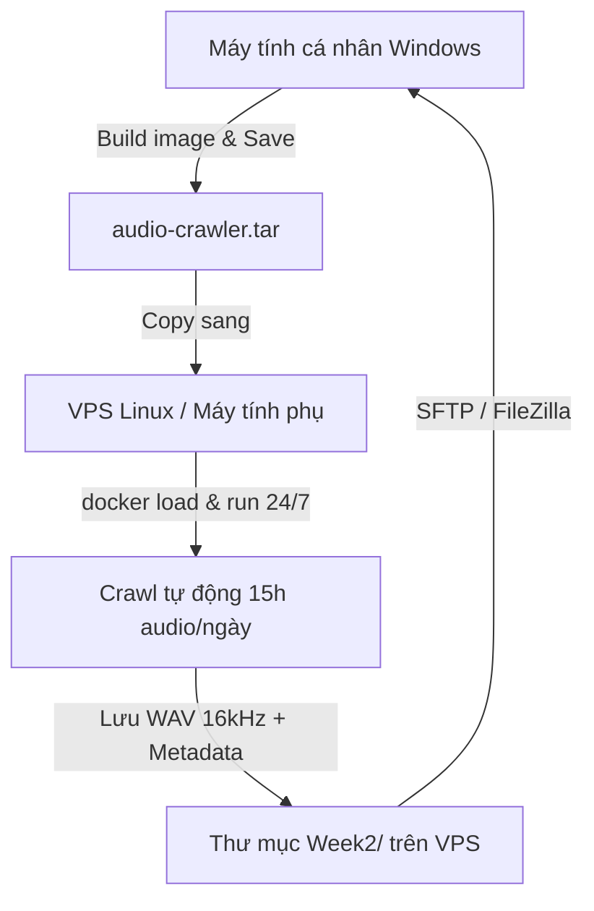

# 🐳 Hướng Dẫn Chi Tiết: Docker, Đóng Gói Sang Máy Khác & Triển Khai Trên Linux / VPS

Tài liệu này hướng dẫn chi tiết từ A đến Z cách:
1. **Đóng gói toàn bộ dự án vào Docker** để mang sang máy tính khác hoặc máy chủ Linux chạy ngay lập tức.
2. **Cài đặt Docker** trên Windows và Linux.
3. **Chạy ngầm crawler 24/7** trên VPS Linux.
4. **Cách sao chép dữ liệu âm thanh** từ máy chủ về máy tính cá nhân.

---

## ❓ 1. Dùng Docker có thể đóng gói và mang sang máy khác không?

> **CÂU TRẢ LỜI: HOÀN TOÀN ĐƯỢC VÀ ĐÂY LÀ CÁCH TỐI ƯU NHẤT!**

Khi đóng gói bằng Docker, **toàn bộ môi trường** gồm:
- Hệ điều hành Linux thu nhỏ (Debian slim)
- Phiên bản Python 3.12 chuẩn
- Công cụ xử lý âm thanh **FFmpeg & ffprobe**
- Toàn bộ thư viện (`yt-dlp`, `librosa`, `scipy`, `soundfile`, `tqdm`,...)
- Toàn bộ mã nguồn crawler

...sẽ được gom lại thành **01 Docker Image duy nhất**. 

**Ưu điểm khi mang sang máy khác:**
- Máy đích **KHÔNG CẦN CÀI PYTHON**, **KHÔNG CẦN CÀI FFMPEG**, không lo lỗi xung đột thư viện hay lỗi phiên bản hệ điều hành.
- Máy đích chỉ cần cài đúng phần mềm Docker là chạy được ngay lập tức.

---

## 📦 2. Cách đóng gói & chuyển sang máy tính khác

Có **3 cách** để chuyển image sang máy tính khác:

---

### Cách 1: Xuất file `.tar` (Copy qua USB / Google Drive - Không cần mạng)

Đây là cách đơn giản và tiện lợi nhất nếu bạn muốn chép sang máy tính khác mà không cần đăng ký tài khoản Docker Hub.

#### Bước 1: Build và xuất file trên máy gốc (Windows / Linux hiện tại)
```powershell
cd c:\HocC\SaydiTool

# 1. Build image
docker build -t audio-crawler:latest .

# 2. Xuất toàn bộ image thành 1 file duy nhất
docker save -o audio-crawler.tar audio-crawler:latest
```
*(File `audio-crawler.tar` sẽ xuất hiện trong thư mục. Bạn copy file này sang USB, ổ cứng ngoài hoặc tải lên Google Drive).*

#### Bước 2: Nạp vào máy tính mới (Windows hoặc Linux khác)
1. Cài Docker trên máy mới.
2. Copy file `audio-crawler.tar` và file `docker-compose.yml` sang máy mới.
3. Mở Terminal / PowerShell tại thư mục đó và nạp image:
```bash
docker load -i audio-crawler.tar
```
4. Chạy ngay lập tức:
```bash
docker run --rm -v ./Week2:/app/Week2 audio-crawler:latest --platform tiktok --keyword "review quán ăn" --workers 4
```

---

### Cách 2: Đẩy lên Docker Hub (Kéo về bất kỳ đâu bằng 1 lệnh)

Nếu bạn có tài khoản trên [Docker Hub](https://hub.docker.com/):

```bash
# 1. Đăng nhập Docker Hub trên máy bạn
docker login

# 2. Đặt tag với username của bạn
docker tag audio-crawler:latest <your-username>/audio-crawler:latest

# 3. Đẩy lên cloud
docker push <your-username>/audio-crawler:latest
```

**Trên máy tính khác (hoặc VPS Linux):**
Chỉ cần gõ 1 lệnh là Docker tự tải về và chạy:
```bash
docker run --rm -v ./Week2:/app/Week2 <your-username>/audio-crawler:latest --platform tiktok --keyword "review quán ăn"
```

---

### Cách 3: Dùng Git + Docker Compose (Khuyến nghị cho lập trình viên)

Trên máy tính mới, bạn chỉ cần tải mã nguồn về và Docker sẽ tự build:
```bash
git clone https://github.com/<your-username>/audio-crawler.git
cd audio-crawler
docker compose up --build
```

---

## 💻 3. Hướng dẫn cài đặt Docker từ đầu

### 3.1. Cài đặt trên Windows 10 / 11

1. **Bật tính năng WSL 2 (Windows Subsystem for Linux):**
   - Mở PowerShell với quyền **Administrator** (Run as Administrator).
   - Chạy lệnh:
     ```powershell
     wsl --install
     ```
   - Khởi động lại máy tính nếu được yêu cầu.

2. **Tải & Cài Docker Desktop:**
   - Tải bộ cài chính thức tại: [https://www.docker.com/products/docker-desktop/](https://www.docker.com/products/docker-desktop/)
   - Chạy file `.exe` vừa tải về, tích chọn **"Use WSL 2 instead of Hyper-V"**.
   - Mở Docker Desktop lên. Khi góc dưới bên trái hiện màu xanh lá **"Engine running"** là đã sẵn sàng.

---

### 3.2. Cài đặt trên Linux (Ubuntu 20.04 / 22.04 / 24.04 / Debian / VPS Cloud)

Trên máy chủ Linux hoặc VPS, chạy các lệnh sau trong terminal:

```bash
# 1. Cập nhật hệ thống
sudo apt update && sudo apt upgrade -y

# 2. Cài đặt Docker tự động bằng script chính thức
curl -fsSL https://get.docker.com -o get-docker.sh
sudo sh get-docker.sh

# 3. Thêm quyền chạy Docker không cần sudo
sudo usermod -aG docker $USER

# 4. Cài đặt Docker Compose plugin
sudo apt install -y docker-compose-plugin

# 5. Khởi động lại terminal hoặc chạy lệnh sau để áp dụng quyền
newgrp docker

# 6. Kiểm tra cài đặt thành công
docker --version
docker compose version
```

---

## 🚀 4. Hướng dẫn chạy Crawler trên Linux / VPS Cloud (Chạy ngầm 24/7)

Chạy trên máy chủ Linux / VPS là giải pháp **tối ưu nhất để đạt 500 giờ** vì:
- Máy chủ cắm điện và kết nối mạng liên tục 24/7.
- Không chiếm băng thông mạng và RAM của máy tính cá nhân.
- Tốc độ tải và xử lý âm thanh trên server thường rất cao.

---

### 4.1. Cấu trúc thư mục trên Linux / VPS

Tạo một thư mục trên VPS:
```bash
mkdir -p ~/saydi_crawler && cd ~/saydi_crawler
```

Đặt các file sau vào thư mục:
- Mã nguồn dự án (hoặc file image `audio-crawler.tar`)
- File `cookies_tiktok.txt` (nếu có)
- File `docker-compose.yml`

---

### 4.2. Các lệnh chạy trên Linux

#### Chạy trực tiếp qua Docker:
```bash
# Chạy crawl TikTok với cookie
docker run --rm \
  -v $(pwd)/Week2:/app/Week2 \
  -v $(pwd)/errors:/app/errors \
  -v $(pwd)/.checkpoints:/app/.checkpoints \
  -v $(pwd)/cookies_tiktok.txt:/app/cookies_tiktok.txt:ro \
  audio-crawler \
  --platform tiktok \
  --keyword "review quán ăn" \
  --workers 4 \
  --cookies cookies_tiktok.txt
```

---

### 4.3. Cách chạy ngầm 24/7 (Tắt máy tính cá nhân vẫn tiếp tục cào)

Có 2 cách để crawler tiếp tục chạy trên VPS ngay cả khi bạn tắt máy tính hoặc ngắt kết nối SSH:

#### Cách 1: Dùng cờ `-d` của Docker Compose (Đơn giản nhất)
```bash
# Chạy ngầm trong nền
docker compose up -d

# Xem log tiến trình cào theo thời gian thực
docker compose logs -f

# Dừng tiến trình
docker compose down
```

#### Cách 2: Dùng công cụ `screen` hoặc `tmux` trên Linux
```bash
# 1. Cài screen
sudo apt install -y screen

# 2. Tạo một màn hình ảo tên là "crawl"
screen -S crawl

# 3. Chạy lệnh crawl bên trong màn hình này
docker run --rm -v $(pwd)/Week2:/app/Week2 audio-crawler --platform tiktok --keyword "review quán ăn" --workers 4

# 4. Bấm tổ hợp phím [Ctrl + A] rồi bấm phím [D] để thoát ra ngoài (tiến trình vẫn chạy ngầm).
# Bạn có thể an tâm tắt terminal và tắt máy tính của mình.

# 5. Khi nào muốn vào lại xem tiến độ:
screen -r crawl
```

---

## 📥 5. Cách lấy file Audio từ VPS Linux về máy tính cá nhân

Sau khi VPS cào xong dữ liệu âm thanh, bạn có thể tải toàn bộ thư mục `Week2/` về máy tính bằng một trong các cách sau:

### Cách 1: Dùng phần mềm FileZilla / WinSCP (Giao diện đồ họa - Dễ nhất)
1. Tải [FileZilla Client](https://filezilla-project.org/) hoặc [WinSCP](https://winscp.net/).
2. Chọn giao thức **SFTP**.
3. Điền `Host` (IP của VPS), `Username` (root hoặc ubuntu), `Password` (hoặc SSH Key), `Port` (22).
4. Kéo thả thư mục `Week2` từ VPS về ổ cứng máy tính cá nhân của bạn.

### Cách 2: Dùng lệnh `scp` hoặc `rsync` từ PowerShell Windows
Mở PowerShell trên máy tính cá nhân:
```powershell
# Tải toàn bộ thư mục Week2 từ VPS về máy tính
scp -r root@<IP_VPS>:~/saydi_crawler/Week2 c:\HocC\SaydiTool\
```

---

## 📊 6. Tóm tắt luồng làm việc tối ưu (Multi-machine Workflow)



| Môi trường | Nhiệm vụ phù hợp |
|---|---|
| **Máy tính cá nhân (Windows)** | Viết code, test thử nghiệm với `--dry-run`, nghe kiểm tra chất lượng file `.wav` |
| **VPS Linux / Máy tính phụ** | Cắm máy chạy Docker cào dữ liệu liên tục 24/7 với 4 workers để nhanh chóng đạt mốc 500 giờ |
