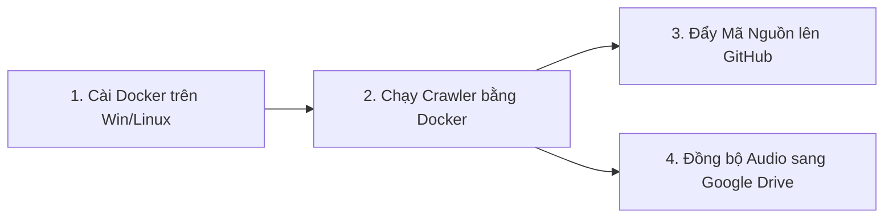

# 📘 Cẩm Nang Toàn Diện: Từ Cài Đặt Docker, Linux -> Chạy Crawler -> Đẩy Lên GitHub -> Đồng Bộ Google Drive

Tài liệu này hướng dẫn chi tiết từng bước (Step-by-Step) cho toàn bộ quy trình làm việc:



---

## 📑 MỤC LỤC

1. [BƯỚC 1: CÀI ĐẶT DOCKER (Windows & Linux)](#-bước-1-cài-đặt-docker)
2. [BƯỚC 2: BUILD VÀ CHẠY CRAWLER BẰNG DOCKER](#-bước-2-build-và-chạy-crawler-bằng-docker)
3. [BƯỚC 3: ĐẨY MÃ NGUỒN DỰ ÁN LÊN GITHUB](#-bước-3-đẩy-mã-nguồn-dự-án-lên-github)
4. [BƯỚC 4: ĐỒNG BỘ DỮ LIỆU ÂM THANH (WAV) SANG GOOGLE DRIVE](#-bước-4-đồng-bộ-dữ-liệu-âm-thanh-sang-google-drive)
5. [TỔNG HỢP CÁC LỆNH THƯỜNG DÙNG HÀNG NGÀY](#-tổng-hợp-các-lệnh-thường-dùng-hàng-ngày)

---

## 🐳 BƯỚC 1: CÀI ĐẶT DOCKER

### 1.1. Cài đặt trên Windows 10 / 11

1. **Bật WSL 2 (Windows Subsystem for Linux):**
   - Mở **PowerShell** bằng cách click chuột phải vào nút Start -> chọn **Terminal (Admin)** hoặc **Windows PowerShell (Admin)**.
   - Chạy lệnh:
     ```powershell
     wsl --install
     ```
   - Khởi động lại máy tính nếu được yêu cầu.

2. **Cài đặt Docker Desktop:**
   - Tải file cài đặt từ trang chủ: [https://www.docker.com/products/docker-desktop/](https://www.docker.com/products/docker-desktop/)
   - Chạy file cài đặt `.exe`, tích chọn **"Use WSL 2 instead of Hyper-V"**.
   - Mở **Docker Desktop** lên. Chờ khoảng 1–2 phút cho đến khi biểu tượng cá voi ở góc dưới bên trái chuyển sang màu **xanh lá cây (Engine running)**.
   - Mở PowerShell kiểm tra:
     ```powershell
     docker --version
     docker compose version
     ```

---

### 1.2. Cài đặt trên Linux (Ubuntu 20.04 / 22.04 / 24.04, Debian hoặc VPS Cloud)

Mở cửa sổ Terminal (hoặc kết nối SSH vào VPS) và chạy chuỗi lệnh sau:

```bash
# 1. Cập nhật hệ thống
sudo apt update && sudo apt upgrade -y

# 2. Cài đặt Docker tự động bằng script chính thức
curl -fsSL https://get.docker.com -o get-docker.sh
sudo sh get-docker.sh

# 3. Phân quyền cho user hiện tại (không cần gõ sudo mỗi khi dùng docker)
sudo usermod -aG docker $USER

# 4. Cài đặt Docker Compose
sudo apt install -y docker-compose-plugin

# 5. Kích hoạt quyền vừa gán (hoặc logout rồi login lại)
newgrp docker

# 6. Kiểm tra cài đặt thành công
docker --version
docker compose version
```

---

## 🚀 BƯỚC 2: BUILD VÀ CHẠY CRAWLER BẰNG DOCKER

### 2.1. Build Docker Image (Chỉ cần chạy 1 lần đầu)

Mở PowerShell tại thư mục dự án `c:\HocC\SaydiTool` (hoặc thư mục trên Linux):

```bash
# Build image tên là "audio-crawler"
docker build -t audio-crawler .
```

---

### 2.2. Chạy thử nghiệm (Dry-Run kiểm tra danh sách link)

```bash
# Thử tìm kiếm 10 video TikTok theo keyword mà KHÔNG tải âm thanh về
docker run --rm audio-crawler --platform tiktok --keyword "review quán ăn Hà Nội" --dry-run
```

---

### 2.3. Chạy Crawl chính thức (Có lưu file WAV ra máy)

> ⚠️ **LƯU Ý QUAN TRỌNG VỀ VOLUME MOUNT (`-v`):**  
> Lệnh `-v ${PWD}/Week2:/app/Week2` giúp toàn bộ file âm thanh tải về trong container được **lưu trực tiếp ra thư mục `Week2` trên ổ cứng máy bạn**. Nếu tắt container, dữ liệu âm thanh vẫn còn nguyên.

#### Trên Windows (PowerShell):
```powershell
# Chạy crawl TikTok (4 workers, có file cookie)
docker run --rm `
  -v ${PWD}/Week2:/app/Week2 `
  -v ${PWD}/errors:/app/errors `
  -v ${PWD}/.checkpoints:/app/.checkpoints `
  -v ${PWD}/cookies_tiktok.txt:/app/cookies_tiktok.txt:ro `
  audio-crawler `
  --platform tiktok `
  --keyword "review quán ăn Hà Nội" `
  --workers 4 `
  --cookies cookies_tiktok.txt
```

#### Trên Linux / VPS:
```bash
# Chạy crawl TikTok trên Linux
docker run --rm \
  -v $(pwd)/Week2:/app/Week2 \
  -v $(pwd)/errors:/app/errors \
  -v $(pwd)/.checkpoints:/app/.checkpoints \
  -v $(pwd)/cookies_tiktok.txt:/app/cookies_tiktok.txt:ro \
  audio-crawler \
  --platform tiktok \
  --keyword "review quán ăn Hà Nội" \
  --workers 4 \
  --cookies cookies_tiktok.txt
```

---

### 2.4. Chạy Ngầm 24/7 Bằng Docker Compose (Rất thích hợp cho VPS)

Nếu muốn máy chủ tự động chạy cào trong nền liên tục mà bạn có thể tắt máy tính cá nhân:

```bash
# 1. Khởi động chạy ngầm trong nền
docker compose up -d

# 2. Xem log tiến độ cào realtime
docker compose logs -f

# 3. Dừng chạy
docker compose down
```

---

## 🐙 BƯỚC 3: ĐẨY MÃ NGUỒN DỰ ÁN LÊN GITHUB

> ⚠️ **Quy tắc quan trọng:**  
> GitHub chỉ dùng để lưu **mã nguồn (`.py`, `.md`, `.txt`, `Dockerfile`)**. File âm thanh `.wav` nặng hàng chục GB **KHÔNG ĐƯỢC** đẩy lên GitHub (đã được file `.gitignore` tự động chặn lại).

### 3.1. Tạo Repository mới trên GitHub
1. Truy cập [https://github.com/new](https://github.com/new).
2. Đặt tên Repository: `SaydiTool` hoặc `audio-crawler`.
3. Chọn chế độ **Private** (Riêng tư) hoặc **Public** (Công khai).
4. **KHÔNG** tích chọn "Add a README file" (vì dự án đã có sẵn).
5. Bấm nút **Create repository**.

---

### 3.2. Đẩy mã nguồn từ máy lên GitHub

Mở PowerShell tại `c:\HocC\SaydiTool`:

```powershell
# 1. Đổi tên nhánh chính thành main
git branch -M main

# 2. Thêm đường dẫn remote GitHub của bạn (thay <your-username> và <repo-name>)
git remote add origin https://github.com/<your-username>/SaydiTool.git

# 3. Đẩy toàn bộ mã nguồn lên GitHub
git push -u origin main
```

---

### 3.3. Các lệnh Git sử dụng hàng ngày khi sửa code

Sau này mỗi khi bạn chỉnh sửa hoặc bổ sung code:

```powershell
# 1. Xem các file vừa sửa
git status

# 2. Lưu các thay đổi
git add .
git commit -m "update: tối ưu hóa bộ lọc âm thanh và cấu hình crawl"

# 3. Đẩy lên GitHub
git push
```

---

## ☁️ BƯỚC 4: ĐỒNG BỘ DỮ LIỆU ÂM THANH (WAV) SANG GOOGLE DRIVE

Mục tiêu 500 giờ audio sẽ có dung lượng khoảng **50 GB – 100 GB**. Dưới đây là các phương án tối ưu để chuyển dữ liệu lên Google Drive:

---

### 🌟 Cách 1: Tự động đồng bộ bằng Rclone (Khuyên dùng cho cả Windows & Linux VPS)

`rclone` là công cụ chuẩn công nghiệp số 1 thế giới để đồng bộ thư mục lên Google Drive qua dòng lệnh, tốc độ cực nhanh, có thể resume nếu mất mạng.

#### Bước 1: Cài đặt Rclone
- **Trên Windows:** Tải tại [https://rclone.org/downloads/](https://rclone.org/downloads/) (hoặc chạy: `winget install Rclone.Rclone`).
- **Trên Linux/VPS:** Chạy lệnh:
  ```bash
  sudo -v ; curl https://rclone.org/install.sh | sudo bash
  ```

#### Bước 2: Cấu hình kết nối Google Drive (Chỉ làm 1 lần)
Chạy lệnh trong terminal:
```bash
rclone config
```
1. Nhập `n` (New remote).
2. Đặt tên: `gdrive`.
3. Nhập số tương ứng với `Google Drive` (thường là `18` hoặc gõ `drive`).
4. Bỏ trống `client_id` và `client_secret` (Enter để mặc định).
5. Chọn quyền `1` (Full access).
6. Khi hỏi `Use auto config?`:
   - Nếu làm trên Windows có trình duyệt: chọn `y` -> trình duyệt mở ra đăng nhập tài khoản Google -> bấm **Allow**.
   - Nếu làm trên VPS: chọn `n` -> copy đường link mở trên máy tính cá nhân để lấy mã xác thực dán lại.
7. Chọn `y` để xác nhận lưu cấu hình.

#### Bước 3: Lệnh đẩy thư mục âm thanh lên Google Drive
Sau khi cào xong thư mục `Week2`, chỉ cần chạy 1 lệnh:

```bash
# Trên Windows:
rclone copy c:\HocC\SaydiTool\Week2 gdrive:ASR_Dataset/Week2 --progress

# Trên Linux / VPS:
rclone copy ~/saydi_crawler/Week2 gdrive:ASR_Dataset/Week2 --progress
```

> **Ưu điểm của Rclone:**
> - Tự động bỏ qua các file đã tải lên trước đó (không bị upload trùng).
> - Tự động thử lại nếu mất mạng giữa chừng.
> - Hiển thị tốc độ tải và % tiến độ chi tiết.

---

### 📂 Cách 2: Dùng Google Drive for Desktop (Đơn giản trên máy Windows cá nhân)

1. Tải và cài đặt phần mềm **Google Drive for Desktop** từ Google: [https://www.google.com/drive/download/](https://www.google.com/drive/download/)
2. Đăng nhập tài khoản Google của bạn.
3. Trên máy tính của bạn sẽ xuất hiện một ổ đĩa ảo (ví dụ: `G:\My Drive` hoặc `G:\Shared drives`).
4. Bạn chỉ cần copy thư mục `Week2` từ `c:\HocC\SaydiTool\Week2` dán vào ổ `G:\My Drive\ASR_Dataset\`, phần mềm sẽ tự động đồng bộ ngầm lên đám mây.

---

## 📋 5. TỔNG HỢP CÁC LỆNH THƯỜNG DÙNG HÀNG NGÀY

| Công việc | Lệnh thực hiện |
|---|---|
| **Chạy kiểm tra code** | `pytest -o pythonpath=. -v` |
| **Cào TikTok có Cookie** | `python main.py --platform tiktok --keyword "review quán ăn" --workers 4 --cookies cookies_tiktok.txt` |
| **Cào qua Docker** | `docker run --rm -v ${PWD}/Week2:/app/Week2 audio-crawler --platform tiktok --keyword "review quán ăn" --workers 4` |
| **Chạy lại file lỗi** | `python retry_failed.py --platform tiktok` |
| **Lưu code lên GitHub** | `git add . && git commit -m "update code" && git push` |
| **Đẩy Audio lên Google Drive** | `rclone copy ./Week2 gdrive:ASR_Dataset/Week2 --progress` |
