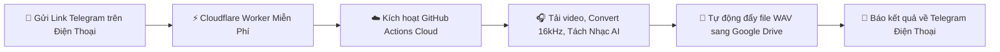
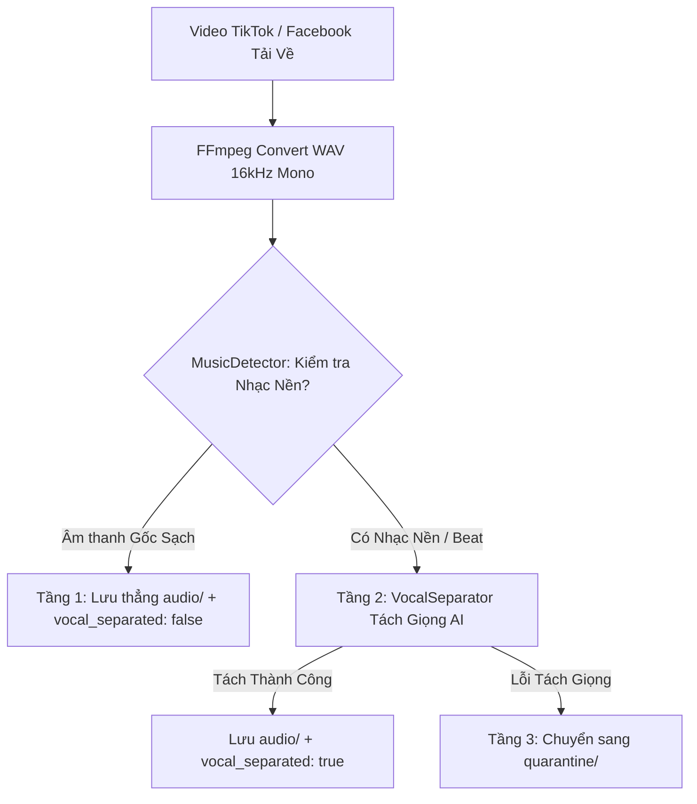

# 🎙️ SAYDITOOL — VIETNAMESE SPEECH AUDIO CRAWLER & AI PIPELINE
> **Dự án:** Hệ thống Thu thập & Xử lý Dữ liệu Âm thanh Tiếng Việt quy mô lớn cho huấn luyện nhận dạng giọng nói (Vietnamese ASR Dataset Pipeline).  
> **Mục tiêu:** Thu thập 500 giờ âm thanh chuẩn ASR trong 7 tuần từ Facebook Reels & TikTok.  
> **Phiên bản:** 2.5 (Tích hợp Tách Giọng AI + Điều Khiển Từ Xa Bằng Telegram Bot & Cloud GitHub Actions).

---

## 🧭 BẢNG NHẬN DIỆN MÔI TRƯỜNG & TERMINAL (QUAN TRỌNG)
Trước khi chạy bất kỳ câu lệnh nào, hãy chú ý **Biểu tượng & Loại Terminal** được ghi chú ở từng khối lệnh:

| Biểu tượng | Loại Terminal / Môi trường | Cách mở đúng |
|---|---|---|
| 🔵 **`[PowerShell - Thư mục Dự án]`** | Windows PowerShell tại `C:\HocC\SaydiTool` | Mở File Explorer vào `C:\HocC\SaydiTool`, bấm vào thanh địa chỉ gõ `powershell` rồi gõ Enter (Hiện: `PS C:\HocC\SaydiTool>`) |
| 🛡️ **`[PowerShell - Administrator]`** | Windows PowerShell quyền Quản trị | Bấm phím `Windows` -> gõ `powershell` -> Click chuột phải chọn **Run as Administrator** (Dùng khi cài phần mềm) |
| 🐧 **`[Linux - WSL 2 Ubuntu]`** | Terminal Linux Ubuntu | Mở ứng dụng **Ubuntu** từ Start Menu, hoặc từ PowerShell gõ `wsl` (Hiện: `user@machine:/mnt/c/HocC/SaydiTool$`) |
| 📱 **`[Telegram trên Điện thoại]`** | App Telegram Mobile | Mở ứng dụng Telegram trên điện thoại để gửi link cào từ xa |
| 🌐 **`[GitHub / Cloudflare Web]`** | Trình duyệt Web | Thao tác trên website `github.com` hoặc `dash.cloudflare.com` |

---

## 📑 MỤC LỤC TOÀN TẬP
1. [Cấu trúc Thư mục Dự án](#1-cấu-trúc-thư-mục-dự-án)
2. [Thông số Kỹ thuật Âm thanh & Chuẩn Dữ liệu](#2-thông-số-kỹ-thuật-âm-thanh--chuẩn-dữ-liệu)
3. [Cài đặt Môi trường từ Số 0 (Windows, FFmpeg, Python, Docker)](#3-cài-đặt-môi-trường-từ-số-0)
4. [Lấy Cookies & Chuẩn bị Danh sách Link](#4-lấy-cookies--chuẩn-bị-danh-sách-link)
5. [Quy trình Vận hành Crawler (4 Cách Chạy)](#5-quy-trình-vận-hành-crawler-4-cách-chạy)
   - [Cách 1: Chạy trực tiếp bằng Python trên máy tính](#cách-1-chạy-trực-tiếp-bằng-python-trên-máy-tính)
   - [Cách 2: Chạy đóng gói bằng Docker Container](#cách-2-chạy-đóng-gói-bằng-docker-container)
   - [Cách 3: Chạy Telegram Bot nhận lệnh trên máy tính](#cách-3-chạy-telegram-bot-nhận-lệnh-trên-máy-tính)
   - [Cách 4: Đỉnh cao: Cào 100% Cloud (Gửi Telegram ➔ GitHub Actions ➔ Google Drive)](#cách-4-đỉnh-cao-cào-100-cloud-gửi-telegram--github-actions--google-drive)
6. [Pipeline Hybrid 3 Tầng: Tách Giọng & Khử Nhạc AI](#6-pipeline-hybrid-3-tầng-tách-giọng--khử-nhạc-ai)
7. [Đóng gói Docker chuyển sang Máy tính khác](#7-đóng-gói-docker-chuyển-sang-máy-tính-khác)
8. [Đẩy Dự án lên GitHub & Quản lý Mã nguồn](#8-đẩy-dự-án-lên-github--quản-lý-mã-nguồn)
9. [Cài đặt Rclone & Đồng bộ Google Drive](#9-cài-đặt-rclone--đồng-bộ-google-drive)
10. [Bảng Tra cứu Toàn bộ Câu Lệnh (Cheatsheet)](#10-bảng-tra-cứu-toàn-bộ-câu-lệnh-cheatsheet)
11. [Cẩm nang Xử lý Sự cố & Debug Lỗi (Troubleshooting)](#11-cẩm-nang-xử-lý-sự-cố--debug-lỗi-troubleshooting)

---

## 1. CẤU TRÚC THƯ MỤC DỰ ÁN

```text
SaydiTool/
├── .github/workflows/          # [Cloud CI/CD] Tự động hóa cào đám mây
│   └── cloud_crawler.yml       # Workflow GitHub Actions tự động đẩy Google Drive & báo Telegram
├── crawlers/                   # [Module Cào Dữ Liệu - Network & Extractors]
│   ├── __init__.py
│   ├── base.py                 # BaseCrawler: tải video, convert WAV, retry, backoff, temp cookies
│   ├── facebook.py             # FacebookCrawler: bóc tách regex Reels & Videos
│   └── tiktok.py               # TikTokCrawler: cào URL, channel, cookie impersonation (Chrome 131)
├── processors/                 # [Module Xử Lý Âm Thanh - AI Engineering]
│   ├── __init__.py
│   ├── audio_converter.py      # FFmpeg WAV 16kHz Mono converter & ffprobe validation
│   ├── music_detector.py       # Bộ phát hiện nhạc nền 2 tầng (Metadata Heuristic + Librosa)
│   └── vocal_separator.py      # Dual-Engine AI Vocal Separator (Demucs + Spectral Noise Gating)
├── storage/                    # [Module Quản Lý Dữ Liệu & Lưu Trữ]
│   ├── __init__.py
│   ├── dedup.py                # Thread-safe ID deduplication (chống cào trùng lặp)
│   ├── metadata_writer.py      # Ghi metadata.json & summary.json chuẩn JSON schema
│   └── state_manager.py        # Checkpoint lưu trạng thái resume khi gặp sự cố
├── utils/                      # [Module Tiện Ích Chung]
│   ├── __init__.py
│   ├── logger.py               # Ghi log đa màu sắc, chuẩn UTF-8 Windows
│   ├── proxy_manager.py        # Quản lý User-Agent rotation & Proxy list
│   └── rate_limiter.py         # Điều tiết tốc độ request với Random Jitter & Backoff
├── tests/                      # [Bộ Kiểm Thử Tự Động] 11 unit tests bao phủ 100% core logic
│   ├── test_audio_converter.py
│   ├── test_bot.py
│   ├── test_crawler_parsing.py
│   ├── test_dedup.py
│   ├── test_metadata_writer.py
│   ├── test_music_detector.py
│   ├── test_state_manager.py
│   └── test_vocal_separator.py
├── docs/                       # [Tài Liệu Toàn Tập]
│   ├── MASTER_GUIDE.md         # Bản sao lưu cẩm nang
│   └── TELEGRAM_CLOUD_SETUP.md # Hướng dẫn thiết lập cầu nối Telegram Cloudflare Worker
├── Week2/                      # Thư mục chứa dữ liệu đầu ra theo tuần
│   └── YYYY-MM-DD/             # Dữ liệu theo ngày cào (VD: 2026-08-19)
│       ├── audio/              # File âm thanh WAV sạch đạt chuẩn huấn luyện ASR
│       ├── quarantine/         # File audio cách ly (nếu không tách được nhạc)
│       ├── metadata.json       # Metadata chi tiết từng file
│       └── summary.json        # Thống kê tổng hợp số lượng & tổng số giờ
├── .checkpoints/               # Checkpoint lưu trạng thái chạy
├── errors/                     # Log lỗi chi tiết (failed_YYYY-MM-DD.jsonl)
├── logs/                       # Log thực thi hệ thống (crawler.log)
├── bot.py                      # Telegram Bot Receiver cho phép cào từ xa bằng điện thoại
├── config.py                   # Cấu hình trung tâm (tuần, sample rate, rate limit, timeout)
├── main.py                     # File chạy CLI chính của toàn bộ dự án
├── retry_failed.py             # Script tự động thử lại các URL bị lỗi
├── urls.txt                    # File chứa danh sách link cần cào hàng loạt
├── cookies_tiktok.txt          # Cookie Netscape format cho TikTok
├── Dockerfile                  # Cấu hình đóng gói Docker container
├── docker-compose.yml          # Cấu hình chạy ngầm Docker Compose
├── requirements.txt            # Danh sách thư viện Python
└── README.md                   # Tài liệu chính của dự án
```

---

## 2. THÔNG SỐ KỸ THUẬT ÂM THANH & CHUẨN DỮ LIỆU

### 🎯 Chuẩn đầu ra Audio (ASR Standard):
- **Định dạng:** WAV PCM 16-bit Little Endian (`pcm_s16le`).
- **Sample Rate:** `16,000 Hz` (16 kHz).
- **Kênh:** `1 Channel` (Mono).
- **Thời lượng:** `5.0s` đến `600.0s` (10 phút).
- **Tên file:** `{item_id}.wav` (VD: `tt_7675666420574735634.wav`, `fb_1410384157640503.wav`).

### 📄 Cấu trúc `metadata.json`:
```json
[
  {
    "item_id": "tt_7675666420574735634",
    "platform": "tiktok",
    "platform_video_id": "7675666420574735634",
    "video_url": "https://www.tiktok.com/@kienthuckinhte28/video/7675666420574735634",
    "title": "Từ một tờ tiền 500.000 vnđ...",
    "description": "Từ một tờ tiền 500.000 vnđ...",
    "posted_at": "2026-08-19T16:35:41+07:00",
    "language_raw": "vi",
    "audio_path": "audio/tt_7675666420574735634.wav",
    "duration_seconds": 101.542,
    "crawl_batch": "tt_20260819_01",
    "crawled_at": "2026-08-19T18:50:25+07:00",
    "platform_meta": {
      "music_is_original": false,
      "is_duet": false,
      "is_stitch": false,
      "has_platform_captions": false
    },
    "vocal_separated": true,
    "clean_method": "demucs_ai"
  }
]
```

### 📊 Cấu trúc `summary.json`:
```json
{
  "platform": "tiktok",
  "crawl_date": "2026-08-19",
  "batch_count": 1,
  "audio_spec": {
    "sample_rate": 16000,
    "channels": 1,
    "format": "wav_pcm_s16le"
  },
  "items_delivered": 100,
  "unique_item_ids": 100,
  "vocal_separated_count": 88,
  "total_hours": 3.25,
  "error_count": 0
}
```

---

## 3. CÀI ĐẶT MÔI TRƯỜNG TỪ SỐ 0

### 🖥️ 3.1. Cài đặt trên Windows (Host)

> 🛡️ **`[PowerShell - Administrator]`**  
> Bấm phím `Windows` -> gõ `powershell` -> Chuột phải chọn **Run as Administrator**:

```powershell
# Cài đặt FFmpeg qua winget:
winget install Gyan.FFmpeg

# Kiểm tra FFmpeg đã nhận chưa:
ffmpeg -version
```

> 🔵 **`[PowerShell - Thư mục Dự án]`**  
> Mở PowerShell tại `C:\HocC\SaydiTool`:

```powershell
# 1. Chuyển vào đúng thư mục dự án:
cd C:\HocC\SaydiTool

# 2. Tạo môi trường ảo .venv:
python -m venv .venv

# 3. Kích hoạt môi trường ảo:
.\.venv\Scripts\Activate.ps1

# 4. Cài đặt toàn bộ thư viện:
pip install -r requirements.txt
```

---

### 🐳 3.2. Cài đặt Docker & WSL 2 Linux

> 🛡️ **`[PowerShell - Administrator]`**:

```powershell
# Cài đặt WSL 2 với bản phân phối Ubuntu:
wsl --install -d Ubuntu
# (Khởi động lại máy tính nếu Windows yêu cầu)
```

1. **Cài Docker Desktop:** Tải bộ cài từ `docker.com/products/docker-desktop` và cài đặt.
   - Trong quá trình cài đặt: Tích chọn **Use WSL 2 instead of Hyper-V**.
   - Mở Docker Desktop -> **Settings** -> **Resources** -> **WSL Integration** -> Bật Ubuntu -> Nhấn **Apply & Restart**.

> 🔵 **`[PowerShell - Thư mục Dự án]`**:

```powershell
# Kiểm tra Docker đã chạy thành công chưa:
docker --version
docker ps
```

---

## 4. LẤY COOKIES & CHUẨN BỊ DANH SÁCH LINK

### 🍪 4.1. Xuất file `cookies_tiktok.txt`:
1. Dùng trình duyệt Chrome, cài tiện ích: **Get cookies.txt LOCALLY**.
2. Đăng nhập vào trang `tiktok.com`.
3. Bấm vào icon tiện ích -> Chọn định dạng **Netscape** -> Nhấn **Export**.
4. Lưu file với tên `cookies_tiktok.txt` vào thư mục dự án `C:\HocC\SaydiTool\cookies_tiktok.txt`.

### 📝 4.2. Chuẩn bị file [`urls.txt`](file:///c:/HocC/SaydiTool/urls.txt):
Mở file `urls.txt` trong thư mục dự án và dán các link video cần cào (mỗi dòng 1 link):
```text
https://www.tiktok.com/@kienthuckinhte28/video/7675666420574735634
https://www.tiktok.com/@vtv24news/video/7391234567890123456
https://www.facebook.com/reel/1410384157640503
https://www.facebook.com/watch?v=1039665577514847
```

---

## 5. QUY TRÌNH VẬN HÀNH CRAWLER (4 CÁCH CHẠY)

---

### 👉 Cách 1: Chạy trực tiếp bằng Python trên máy tính — *Khuyên dùng khi ngồi máy*

> 🔵 **`[PowerShell - Thư mục Dự án]`**:

```powershell
cd C:\HocC\SaydiTool
.\.venv\Scripts\Activate.ps1

# Cào từ file danh sách urls.txt (Có tự động tách nhạc):
python main.py --platform tiktok --keyword "urls.txt" --cookies cookies_tiktok.txt --workers 4

# Cào Facebook theo từ khóa tìm kiếm:
python main.py --platform facebook --keyword "học tiếng Việt" --workers 4

# Cào toàn bộ video từ 1 kênh TikTok cụ thể:
python main.py --platform tiktok --keyword "https://www.tiktok.com/@vtv24news" --cookies cookies_tiktok.txt --workers 4

# Chạy thử nghiệm xem danh sách link, không tải file (Dry Run):
python main.py --platform facebook --keyword "học tiếng Việt" --dry-run
```

---

### 👉 Cách 2: Chạy đóng gói bằng Docker Container

> 🔵 **`[PowerShell - Thư mục Dự án]`**:

```powershell
cd C:\HocC\SaydiTool

# 1. Build image Docker (Chỉ làm lần đầu hoặc khi sửa code):
docker build -t audio-crawler .

# 2. Chạy cào TikTok mount thư mục đầu ra Week2:
docker run --rm `
  -v ${PWD}/Week2:/app/Week2 `
  -v ${PWD}/urls.txt:/app/urls.txt `
  -v ${PWD}/cookies_tiktok.txt:/app/cookies_tiktok.txt `
  audio-crawler `
  --platform tiktok `
  --keyword "urls.txt" `
  --cookies cookies_tiktok.txt `
  --workers 4

# 3. Chạy nền 24/7 bằng Docker Compose:
docker compose up -d
# Xem log:
docker compose logs -f
# Dừng:
docker compose down
```

---

### 👉 Cách 3: Chạy Telegram Bot nhận lệnh trên máy tính

Cho phép bạn bật bot chạy ẩn trên máy tính ở nhà, sau đó cầm điện thoại ra ngoài gửi link vào Telegram.

> 🔵 **`[PowerShell - Thư mục Dự án]`**:

```powershell
cd C:\HocC\SaydiTool
.\.venv\Scripts\Activate.ps1

# Chạy bot với Token lấy từ @BotFather:
python bot.py --token "YOUR_TELEGRAM_BOT_TOKEN"
```

> 📱 **`[Telegram trên Điện thoại]`**:
- Mở Telegram trên điện thoại, tìm bot vừa tạo -> Bấm **Start**.
- Lướt TikTok/Facebook thấy video hay -> Bấm **Chia sẻ ➔ Sao chép liên kết** -> Gửi vào Bot.
- Bot tự động cào, tách nhạc và gửi tin nhắn báo kết quả về điện thoại!
- Gõ `/stats` để xem tổng số giờ cào được hôm nay.

---

### 👉 Cách 4: Đỉnh cao: Cào 100% Cloud (Gửi Telegram ➔ GitHub Actions ➔ Google Drive)

> 🌟 **ƯU ĐIỂM:** **TẮT MÁY TÍNH HOÀN TOÀN 100%**, không tốn 1 byte ổ cứng hay mạng nhà. Cầm điện thoại gửi link vào Telegram, máy chủ GitHub tự cào và đẩy thẳng sang Google Drive!



#### 🛠️ HƯỚNG DẪN CÀI ĐẶT TỪNG BƯỚC (LÀM 1 LẦN TRONG 5 PHÚT):

##### Bước 0: Tạo Repo trên GitHub & Đẩy toàn bộ mã nguồn từ máy lên (Làm đầu tiên)
> 🌐 **`[GitHub Web Browser]`**:
1. Đăng nhập vào [github.com](https://github.com) -> Bấm vào dấu **`+`** ở góc trên bên phải -> Chọn **New repository**.
2. Đặt tên Repository: **`SaydiTool`** (Có thể chọn chế độ *Private* để bảo mật mã nguồn hoặc *Public*).
3. **Không tích chọn** bất kỳ ô nào (*Add a README file*, *.gitignore*, *license*) vì dự án trên máy đã có sẵn -> Bấm nút **Create repository**.

> 🔵 **`[PowerShell - Thư mục Dự án]`**:
Mở PowerShell tại `C:\HocC\SaydiTool` và chạy các lệnh sau để đẩy toàn bộ code lên GitHub:

```powershell
cd C:\HocC\SaydiTool

# 1. Liên kết thư mục dự án với GitHub (Thay <tai_khoan> bằng username GitHub của bạn):
git remote add origin https://github.com/<tai_khoan>/SaydiTool.git

# 2. Đổi tên nhánh chính thành main:
git branch -M main

# 3. Đẩy toàn bộ code lên GitHub:
git push -u origin main
```
*(Sau khi đẩy xong, f5 lại trang GitHub bạn sẽ thấy toàn bộ code, file `urls.txt` và thư mục `.github/workflows` đã nằm trên GitHub).*

---

##### Bước 1: Cài đặt Rclone & Đăng nhập Google Drive để lấy file cấu hình (Làm 1 lần)
> 🛡️ **`[PowerShell - Administrator]`**:
Mở PowerShell quyền Administrator và cài đặt Rclone:
```powershell
winget install Rclone.Rclone
```

> 🔵 **`[PowerShell - Thư mục Dự án]`**:
Mở PowerShell tại `C:\HocC\SaydiTool` và chạy cấu hình kết nối Google Drive:
```powershell
rclone config
```
*(Thực hiện tuần tự theo các bước hỏi đáp của Rclone như sau):*
1. Nhập chữ: `n` ➔ Nhấn **Enter** (Tạo new remote).
2. Đặt tên: `gdrive` ➔ Nhấn **Enter**.
3. Chọn loại lưu trữ: gõ chữ `drive` ➔ Nhấn **Enter** (Google Drive).
4. `client_id>`: Nhấn **Enter** để trống.
5. `client_secret>`: Nhấn **Enter** để trống.
6. `scope>`: Nhập số `1` ➔ Nhấn **Enter** (Full access).
7. `service_account_file>`: Nhấn **Enter** để trống.
8. `Edit advanced config?`: Nhập `n` ➔ Nhấn **Enter**.
9. `Use web browser to automatically authenticate`: Nhập `y` ➔ Nhấn **Enter**.  
   👉 *Trình duyệt sẽ tự động bật lên ➔ Đăng nhập tài khoản Google Drive của bạn ➔ Bấm nút **Allow** (Cho phép).*
10. `Configure this as a Shared Drive (Team Drive)?`:
    - 🏢 **Nếu công ty add bạn vào Team Drive riêng:** Nhập `y` ➔ chọn số thứ tự Drive của công ty.
    - 🔗 **Nếu công ty share link thư mục thông thường:** Nhập `n` ➔ Nhấn **Enter**.
11. `Keep this "gdrive" remote?`: Nhập `y` ➔ Nhấn **Enter**.
12. Nhập `q` ➔ Nhấn **Enter** để thoát ra PowerShell.

> 💡 **CƠ CHẾ ĐẢM BẢO UPLOAD ĐÚNG FOLDER CÔNG TY (KHÔNG NHẦM VỚI DRIVE CÁ NHÂN):**  
> Dù trong Google Drive của bạn có hàng nghìn thư mục cá nhân khác, mỗi thư mục trên Google Drive đều có **Mã ID độc nhất toàn cầu** nằm ở cuối đường link URL.  
> Ví dụ link công ty cấp: `https://drive.google.com/drive/folders/16iuu3_UtaGtNEuHJksZAlEeBcqYhclSw` ➔ **Folder ID là:** `16iuu3_UtaGtNEuHJksZAlEeBcqYhclSw`.  
> Hệ thống sử dụng tham số `root_folder_id=16iuu3_UtaGtNEuHJksZAlEeBcqYhclSw` để **khóa mục tiêu chuẩn xác 100% vào đúng thư mục này**, hoàn toàn không đụng chạm đến dữ liệu cá nhân của bạn!

👉 **Lấy nội dung file `rclone.conf` vừa tạo:**
Chạy lệnh sau trong PowerShell để in toàn bộ nội dung cấu hình ra màn hình:
```powershell
rclone config show
```
*(Copy toàn bộ các dòng hiện ra, gồm `[gdrive]`, `type = drive`, `scope = drive`, `token = {...}` để chuẩn bị dán vào GitHub Secret ở Bước 4).*

---

##### Bước 2: Lấy Token Bot Telegram từ `@BotFather`
1. Mở app **Telegram** trên điện thoại -> Tìm kiếm: `@BotFather`.
2. Gõ lệnh: `/newbot` -> Nhập tên Bot (VD: `Saydi Cloud Crawler`) -> Nhập username (VD: `saydi_cloud_bot`).
3. Copy mã **HTTP API Token** (dạng: `7123456789:ABCdefGhIJKlmNoPQRstuVWXyz`).

---

##### Bước 3: Tạo GitHub Personal Access Token (PAT)
> 🌐 **`[GitHub Web Browser]`**:
1. Vào GitHub -> Bấm vào ảnh Avatar góc trên bên phải -> Chọn **Settings**.
2. Cuộn xuống dưới cùng bên trái -> Chọn **Developer settings** -> **Personal access tokens** -> **Tokens (classic)**.
3. Bấm **Generate new token (classic)**:
   - Note: `Saydi Telegram Trigger`
   - Expiration: `No expiration`.
   - Tích chọn quyền: `repo` (Full control) và `workflow`.
4. Bấm **Generate token** và copy đoạn mã token (dạng: `ghp_xxxxxxxxxxxxxxxxxxxxxx`).

---

##### Bước 4: Cấu hình Secrets trên Repo GitHub
> 🌐 **`[GitHub Web Browser]`**:
1. Vào trang Repo `SaydiTool` của bạn trên GitHub -> Bấm tab **Settings** -> **Secrets and variables** -> **Actions**.
2. Bấm **New repository secret** và thêm 2 Secrets sau:
   - **Secret 1:**
     - Name: `RCLONE_CONFIG`
     - Secret: Dán toàn bộ nội dung cấu hình lấy từ lệnh `rclone config show` ở Bước 1 vào.
   - **Secret 2:**
     - Name: `TELEGRAM_BOT_TOKEN`
     - Secret: Dán mã Token Bot Telegram lấy ở Bước 2 vào.

---

##### Bước 5: Tạo Cloudflare Worker miễn phí làm cầu nối (2 phút)
> 🌐 **`[Cloudflare Web Browser]`**:
1. Truy cập trang web miễn phí: [dash.cloudflare.com](https://dash.cloudflare.com) (Đăng ký tài khoản miễn phí nếu chưa có).
2. Vào mục **Workers & Pages** -> Bấm **Create application** -> **Create Worker**.
3. Đặt tên (VD: `saydi-telegram-bridge`) -> Bấm **Deploy**.
4. Bấm vào nút **Edit code** và dán toàn bộ đoạn code JavaScript dưới đây vào:

```javascript
export default {
  async fetch(request, env) {
    if (request.method !== "POST") {
      return new Response("Saydi Telegram Webhook is active!", { status: 200 });
    }

    try {
      const update = await request.json();
      const message = update.message;
      if (!message || !message.text) return new Response("OK");

      const chatId = message.chat.id;
      const text = message.text.trim();

      // Trích xuất URLs
      const urlRegex = /(https?:\/\/(?:www\.|vt\.|vm\.)?(?:tiktok\.com|facebook\.com|fb\.watch)\/[^\s]+)/gi;
      const urls = text.match(urlRegex);

      if (text === "/start" || text === "/help") {
        await sendMessage(
          env.TELEGRAM_BOT_TOKEN,
          chatId,
          "👋 *Saydi Cloud Crawler Bot*\n\nChỉ cần gửi link TikTok hoặc Facebook vào đây. Máy chủ GitHub Actions sẽ tự động cào ngầm, lọc nhạc AI và đẩy thẳng vào Google Drive của bạn!"
        );
        return new Response("OK");
      }

      if (!urls || urls.length === 0) {
        await sendMessage(
          env.TELEGRAM_BOT_TOKEN,
          chatId,
          "ℹ️ Vui lòng gửi link TikTok hoặc Facebook hợp lệ!"
        );
        return new Response("OK");
      }

      // Thông báo đã nhận lệnh
      await sendMessage(
        env.TELEGRAM_BOT_TOKEN,
        chatId,
        `⏳ *Đã nhận link!*\n\`${urls[0]}\`\n\n🚀 Đang kích hoạt máy chủ GitHub Actions cào trên Cloud & đẩy sang Google Drive...`
      );

      // Kích hoạt GitHub Actions qua API repository_dispatch
      const ghResponse = await fetch(
        `https://api.github.com/repos/${env.GITHUB_REPO}/dispatches`,
        {
          method: "POST",
          headers: {
            "Accept": "application/vnd.github.v3+json",
            "Authorization": `Bearer ${env.GITHUB_PAT}`,
            "User-Agent": "Cloudflare-Telegram-Bridge",
          },
          body: JSON.stringify({
            event_type: "telegram_crawl",
            client_payload: {
              url: urls[0],
              chat_id: chatId.toString(),
            },
          }),
        }
      );

      if (!ghResponse.ok) {
        await sendMessage(
          env.TELEGRAM_BOT_TOKEN,
          chatId,
          "❌ Lỗi kích hoạt GitHub Actions. Vui lòng kiểm tra lại GITHUB_PAT!"
        );
      }
    } catch (err) {
      console.error(err);
    }

    return new Response("OK");
  },
};

async function sendMessage(token, chatId, text) {
  await fetch(`https://api.telegram.org/bot${token}/sendMessage`, {
    method: "POST",
    headers: { "Content-Type": "application/json" },
    body: JSON.stringify({
      chat_id: chatId,
      text: text,
      parse_mode: "Markdown",
    }),
  });
}
```

5. Bấm **Deploy** -> Quay ra trang của Worker -> Chọn tab **Settings** -> **Variables and Secrets** -> Thêm 3 biến môi trường:
   - **`TELEGRAM_BOT_TOKEN`**: Token Bot Telegram của bạn ở Bước 2.
   - **`GITHUB_REPO`**: Đường dẫn repo dạng `username/SaydiTool` (VD: `cuongdev/SaydiTool`).
   - **`GITHUB_PAT`**: Token GitHub cá nhân lấy ở Bước 3.
6. Copy đường link URL của Worker vừa tạo (dạng: `https://saydi-telegram-bridge.<subdomain>.workers.dev`).

---

##### Bước 6: Đăng ký Webhook với Telegram (30 giây)
Mở trình duyệt bất kỳ (trên điện thoại hoặc máy tính), dán đường link sau vào thanh địa chỉ rồi nhấn Enter:

```text
https://api.telegram.org/bot<TELEGRAM_BOT_TOKEN>/setWebhook?url=https://saydi-telegram-bridge.<subdomain>.workers.dev
```

👉 Màn hình hiện: `{"ok":true,"result":true,"description":"Webhook was set"}` là **HOÀN TẤT 100%!**

---

#### 📱 CÁCH SỬ DỤNG HÀNG NGÀY:
1. Bạn đang đi ngoài đường, ngồi cafe hoặc nằm giường lướt TikTok / Facebook trên điện thoại.
2. Thấy video hay -> Bấm **Chia sẻ ➔ Sao chép liên kết** -> Gửi vào Telegram Bot.
3. Bot lập tức phản hồi: *"⏳ Đã nhận link! Đang kích hoạt GitHub Actions..."*
4. Sau 1-2 phút, Bot gửi lại tin nhắn:
   ```text
   🎉 ĐÃ CÀO XONG VÀ ĐỒNG BỘ GOOGLE DRIVE!
   • 🎯 File thành công: 1 file
   • ⏱️ Tổng thời lượng: 101.5s
   • ☁️ Google Drive: ASR_Dataset/Week2/
   ```
5. **Bạn mở Google Drive trên điện thoại là file WAV sạch chuẩn 16kHz Mono đã nằm sẵn ở đó!**

---

## 6. PIPELINE HYBRID 3 TẦNG: TÁCH GIỌNG & KHỬ NHẠC AI

Để tận dụng **90% video TikTok dính nhạc nền**, hệ thống tự động xử lý qua 3 tầng:



### ⚙️ Dual-Engine trong VocalSeparator:
1. **Engine 1 (Demucs AI - Meta Research):** Dùng mô hình Deep Learning `htdemucs` bóc tách riêng biệt track Vocals & Accompaniment.
2. **Engine 2 (Spectral Vocal Cleaner - Librosa + NoiseReduce):** Phân tách Harmonic-Percussive và Spectral Gating. Xử lý cực nhanh trong **1-2 giây**, chiếm **0 MB** ổ đĩa.

---

## 7. ĐÓNG GÓI DOCKER CHUYỂN SANG MÁY TÍNH KHÁC

### 📦 Cách 7.1: Đóng gói thành 1 file nén `.tar` (Dùng USB / Google Drive)

> 🔵 **`[Máy A - PowerShell tại C:\HocC\SaydiTool]`**:

```powershell
docker save -o audio-crawler.tar audio-crawler:latest
```

> 🔵 **`[Máy B (Máy khác) - PowerShell]`**:

```powershell
# 1. Nạp image từ file:
docker load -i audio-crawler.tar

# 2. Chạy cào ngay lập tức:
docker run --rm -v ${PWD}/Week2:/app/Week2 audio-crawler --platform facebook --keyword "học tiếng Việt"
```

---

### 🌐 Cách 7.2: Đẩy lên Docker Hub

> 🔵 **`[PowerShell tại C:\HocC\SaydiTool]`**:

```powershell
docker login
docker tag audio-crawler <ten_tai_khoan>/audio-crawler:latest
docker push <ten_tai_khoan>/audio-crawler:latest
```

---

## 8. ĐẨY DỰ ÁN LÊN GITHUB & QUẢN LÝ MÃ NGUỒN

> 🔵 **`[PowerShell - Thư mục Dự án]`**:

```powershell
cd C:\HocC\SaydiTool

git status
git add .
git commit -m "feat: complete Vietnamese audio crawler pipeline with AI vocal separation"

# Liên kết GitHub (Chỉ làm lần đầu):
git remote add origin https://github.com/<tai-khoan-cua-ban>/SaydiTool.git
git branch -M main
git push -u origin main
```

---

## 9. CÀI ĐẶT RCLONE & ĐỒNG BỘ GOOGLE DRIVE

### 📥 9.1. Cài đặt Rclone

> 🛡️ **`[PowerShell - Administrator]`**:

```powershell
winget install Rclone.Rclone
```

> 🔵 **`[PowerShell - Thư mục Dự án]`**:

```powershell
# Cấu hình kết nối Google Drive:
rclone config
# 1. Nhập 'n' (New remote) -> Đặt tên: gdrive
# 2. Chọn loại lưu trữ: 'drive' (Google Drive)
# 3. Để trống Client ID & Secret -> Trình duyệt tự mở để bạn đăng nhập Google Drive -> Nhấn Allow
```

### ☁️ 9.2. Lệnh Đồng bộ dữ liệu

> 🔵 **`[PowerShell - Thư mục Dự án]`**:

```powershell
# Xem danh sách thư mục trên Google Drive:
rclone lsd gdrive:

# Copy toàn bộ thư mục Week2 thẳng vào đúng thư mục của công ty (Dùng Folder ID):
rclone copy C:\HocC\SaydiTool\Week2 gdrive,root_folder_id=16iuu3_UtaGtNEuHJksZAlEeBcqYhclSw:Week2/ --progress

# Đồng bộ 2 chiều (Sync):
rclone sync C:\HocC\SaydiTool\Week2 gdrive,root_folder_id=16iuu3_UtaGtNEuHJksZAlEeBcqYhclSw:Week2/ --progress
```

---

## 10. BẢNG TRA CỨU TOÀN BỘ CÂU LỆNH (CHEATSHEET)

### 🐍 Lệnh Python & Crawler (Chạy tại `PS C:\HocC\SaydiTool>`):
| Mục đích | Câu lệnh PowerShell |
|---|---|
| Kích hoạt môi trường | `.\.venv\Scripts\Activate.ps1` |
| Chạy toàn bộ 11 Unit Tests | `pytest -o pythonpath=. -v` |
| Cào TikTok qua file link | `python main.py --platform tiktok --keyword "urls.txt" --cookies cookies_tiktok.txt --workers 4` |
| Cào Facebook qua từ khóa | `python main.py --platform facebook --keyword "tin tức thời sự" --workers 4` |
| Cào toàn bộ 1 kênh TikTok | `python main.py --platform tiktok --keyword "https://www.tiktok.com/@vtv24news" --cookies cookies_tiktok.txt` |
| Chạy Telegram Bot nhận link | `python bot.py --token "YOUR_TOKEN"` |
| Thử lại các URL bị lỗi | `python retry_failed.py --platform tiktok` |
| Bỏ qua bộ lọc nhạc | `python main.py --platform tiktok --keyword "urls.txt" --skip-music-filter` |

### 🐳 Lệnh Docker (Chạy tại `PS C:\HocC\SaydiTool>`):
| Mục đích | Câu lệnh PowerShell |
|---|---|
| Build lại image | `docker build -t audio-crawler .` |
| Chạy container cào TikTok | `docker run --rm -v ${PWD}/Week2:/app/Week2 audio-crawler --platform tiktok --keyword "urls.txt"` |
| Khởi động chạy ngầm | `docker compose up -d` |
| Xem log thời gian thực | `docker compose logs -f` |
| Xuất image ra file nén | `docker save -o audio-crawler.tar audio-crawler:latest` |
| Nạp image từ file nén | `docker load -i audio-crawler.tar` |
| Dọn dẹp cache Docker | `docker system prune -af` |

### 🐙 Lệnh Git (Chạy tại `PS C:\HocC\SaydiTool>`):
| Mục đích | Câu lệnh PowerShell |
|---|---|
| Xem trạng thái thay đổi | `git status` |
| Lưu commit mới | `git add . ; git commit -m "noi dung commit"` |
| Xem lịch sử commit | `git log --oneline -n 5` |
| Đẩy code lên GitHub | `git push origin main` |

---

## 11. CẨM NANG XỬ LÝ SỰ CỐ & DEBUG LỖI (TROUBLESHOOTING)

### ❌ Lỗi 1: `ModuleNotFoundError: No module named 'yt_dlp'`
- **Môi trường bị:** PowerShell khi chạy `python main.py`.
- **Nguyên nhân:** Chưa kích hoạt môi trường ảo `.venv`.
- **Cách sửa:** Gõ `.\.venv\Scripts\Activate.ps1` trước khi chạy lệnh, hoặc chạy trực tiếp bằng `.\.venv\Scripts\python main.py ...`.

### ❌ Lỗi 2: `[Errno 21] Is a directory: 'cookies_tiktok.txt'`
- **Môi trường bị:** Docker Run trên PowerShell.
- **Nguyên nhân:** Đang đứng ở thư mục `C:\Users\Cuong>` thay vì `C:\HocC\SaydiTool>`, khiến Docker tạo ra một thư mục rỗng.
- **Cách sửa:** Gõ `cd C:\HocC\SaydiTool` trước khi chạy lệnh Docker.

### ❌ Lỗi 3: `[Errno 30] Read-only file system: 'cookies_tiktok.txt'`
- **Môi trường bị:** Docker Run khi mount `:ro`.
- **Nguyên nhân:** yt-dlp cố ghi cập nhật session vào file chỉ đọc.
- **Đã khắc phục:** Hệ thống tự động tạo bản sao ghi được trong `/tmp` để cập nhật session an toàn.

### ❌ Lỗi 4: `TypeError: '>' not supported between instances of 'float' and 'str'`
- **Nguyên nhân:** `YTDLP_RATE_LIMIT` được đặt dạng chuỗi `"500K"`.
- **Đã khắc phục:** Đã chuyển thành số nguyên byte `500 * 1024` trong `config.py`.

### ❌ Lỗi 5: `Docker 500 Internal Server Error / EOF`
- **Môi trường bị:** Docker Desktop.
- **Nguyên nhân:** Ổ C gần hết dung lượng hoặc tiến trình Docker Desktop bị treo.
- **Cách sửa:** 
  1. Click chuột phải biểu tượng Docker ở Taskbar -> chọn **Restart Docker Desktop**.
  2. Hoặc chạy trực tiếp bằng Python `.venv` (`.\.venv\Scripts\python main.py ...`) không cần Docker.

### ❌ Lỗi 6: `[Errno 28] No space left on device`
- **Nguyên nhân:** Ổ C còn dưới 5 GB dung lượng.
- **Cách sửa:**
  1. Chạy `pip cache purge` để giải phóng bộ nhớ đệm.
  2. Hệ thống đã tích hợp **Spectral Vocal Cleaner** nhẹ chỉ tốn 0 MB ổ đĩa thay vì tải 4 GB PyTorch CUDA.

### ❌ Lỗi 7: `TikTok search returns 0 URLs`
- **Nguyên nhân:** Trang tìm kiếm web của TikTok là ứng dụng JavaScript SPA chặn việc cào HTML tĩnh bằng từ khóa.
- **Cách giải quyết tối ưu:** Dán link trực tiếp vào file **`urls.txt`** hoặc truyền link kênh TikTok (VD: `https://www.tiktok.com/@vtv24news`).

---
*Tài liệu được bảo trì và tự động cập nhật bởi Antigravity AI Assistant.*
