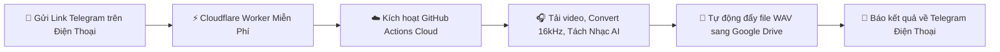
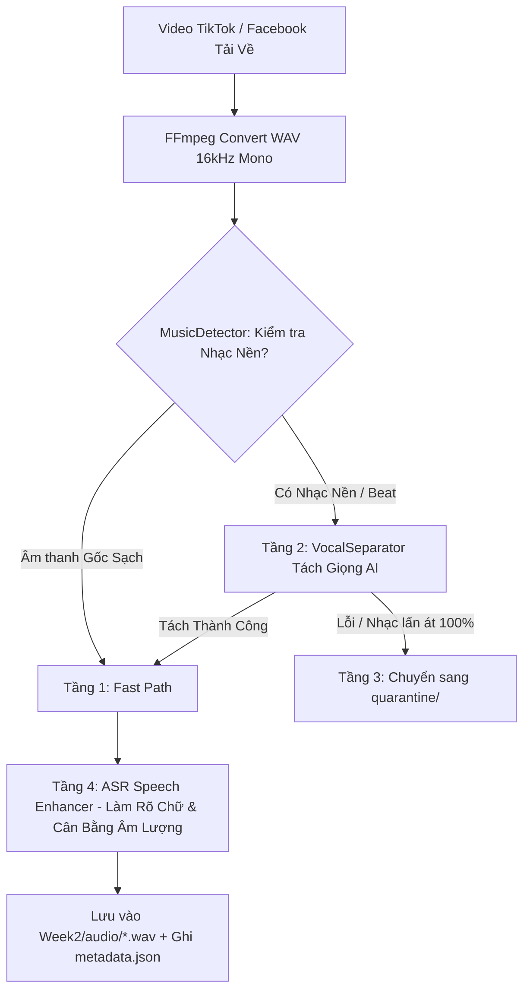

# 🎙️ SAYDITOOL — VIETNAMESE SPEECH AUDIO CRAWLER & AI PIPELINE
> **Dự án:** Hệ thống Thu thập & Xử lý Dữ liệu Âm thanh Tiếng Việt quy mô lớn cho huấn luyện nhận dạng giọng nói (Vietnamese ASR Dataset Pipeline).  
> **Mục tiêu:** Thu thập 500 giờ âm thanh chuẩn ASR trong 7 tuần từ Facebook Reels & TikTok.  
> **Phiên bản:** 2.5 (Tích hợp Tách Giọng AI + Điều Khiển Từ Xa Bằng Telegram Bot & Cloud GitHub Actions).

---

## 🧭 BẢNG NHẬN DIỆN MÔI TRƯỜNG & TERMINAL (QUAN TRỌNG)
Trước khi chạy bất kỳ câu lệnh nào, hãy chú ý **Biểu tượng & Loại Terminal** được ghi chú ở từng khối lệnh:

| Biểu tượng | Loại Terminal / Môi trường | Cách mở đúng |
|---|---|---|
| 🔵 **`[PowerShell - Thư mục Dự án]`** | Windows PowerShell tại `C:\HocC\SaydiTool` | Mở File Explorer vào `C:\HocC\SaydiTool`, bấm vào thanh địa chỉ gõ `powershell` rồi gõ Enter (Hiện: `PS C:\HocC\SaydiTool>`) |
| 🛡️ **`[PowerShell - Administrator]`** | Windows PowerShell quyền Quản trị | Bấm phím `Windows` -> gõ `powershell` -> Click chuột phải chọn **Run as Administrator** (Dùng khi cài phần mềm) |
| 🐧 **`[Linux - WSL 2 Ubuntu]`** | Terminal Linux Ubuntu | Mở ứng dụng **Ubuntu** từ Start Menu, hoặc từ PowerShell gõ `wsl` (Hiện: `user@machine:/mnt/c/HocC/SaydiTool$`) |
| 📱 **`[Telegram trên Điện thoại]`** | App Telegram Mobile | Mở ứng dụng Telegram trên điện thoại để gửi link cào từ xa |
| 🌐 **`[GitHub / Cloudflare Web]`** | Trình duyệt Web | Thao tác trên website `github.com` hoặc `dash.cloudflare.com` |

---

## 📑 MỤC LỤC TOÀN TẬP
1. [Cấu trúc Thư mục Dự án](#1-cấu-trúc-thư-mục-dự-án)
2. [Thông số Kỹ thuật Âm thanh & Chuẩn Dữ liệu](#2-thông-số-kỹ-thuật-âm-thanh--chuẩn-dữ-liệu)
3. [Cài đặt Môi trường từ Số 0 (Windows, FFmpeg, Python, Docker)](#3-cài-đặt-môi-trường-từ-số-0)
4. [Lấy Cookies & Chuẩn bị Danh sách Link](#4-lấy-cookies--chuẩn-bị-danh-sách-link)
5. [Quy trình Vận hành Crawler (4 Cách Chạy)](#5-quy-trình-vận-hành-crawler-4-cách-chạy)
   - [Cách 1: Chạy trực tiếp bằng Python trên máy tính](#cách-1-chạy-trực-tiếp-bằng-python-trên-máy-tính)
   - [Cách 2: Chạy đóng gói bằng Docker Container](#cách-2-chạy-đóng-gói-bằng-docker-container)
   - [Cách 3: Chạy Telegram Bot nhận lệnh trên máy tính](#cách-3-chạy-telegram-bot-nhận-lệnh-trên-máy-tính)
   - [Cách 4: Đỉnh cao: Cào 100% Cloud (Gửi Telegram ➔ GitHub Actions ➔ Google Drive)](#cách-4-đỉnh-cao-cào-100-cloud-gửi-telegram--github-actions--google-drive)
6. [Pipeline Hybrid 3 Tầng: Tách Giọng & Khử Nhạc AI](#6-pipeline-hybrid-3-tầng-tách-giọng--khử-nhạc-ai)
7. [Đóng gói Docker chuyển sang Máy tính khác](#7-đóng-gói-docker-chuyển-sang-máy-tính-khác)
8. [Đẩy Dự án lên GitHub & Quản lý Mã nguồn](#8-đẩy-dự-án-lên-github--quản-lý-mã-nguồn)
9. [Cài đặt Rclone & Đồng bộ Google Drive](#9-cài-đặt-rclone--đồng-bộ-google-drive)
10. [Hướng dẫn Gói 4: Vận hành & Báo cáo Tự động Thông minh (Dashboard & Daily Report)](#10-hướng-dẫn-gói-4-vận-hành--báo-cáo-tự-động-thông-minh-dashboard--daily-report)
11. [Bảng Tra cứu Toàn bộ Câu Lệnh (Cheatsheet)](#11-bảng-tra-cứu-toàn-bộ-câu-lệnh-cheatsheet)
12. [Cẩm nang Xử lý Sự cố & Debug Lỗi (Troubleshooting)](#12-cẩm-nang-xử-lý-sự-cố--debug-lỗi-troubleshooting)

---

## 1. CẤU TRÚC THƯ MỤC DỰ ÁN

```text
SaydiTool/
├── .github/workflows/          # [Cloud CI/CD] Tự động hóa cào đám mây
│   └── cloud_crawler.yml       # Workflow GitHub Actions tự động đẩy Google Drive & báo Telegram
├── crawlers/                   # [Module Cào Dữ Liệu - Network & Extractors]
│   ├── __init__.py
│   ├── base.py                 # BaseCrawler: tải video, convert WAV, retry, backoff, temp cookies
│   ├── facebook.py             # FacebookCrawler: bóc tách regex Reels & Videos
│   └── tiktok.py               # TikTokCrawler: cào URL, kênh lớn, multi-channel urls.txt, API hostname bypass
├── processors/                 # [Module Xử Lý Âm Thanh - AI Engineering]
│   ├── __init__.py
│   ├── audio_converter.py      # FFmpeg WAV 16kHz Mono converter & ffprobe validation
│   ├── music_detector.py       # Bộ phát hiện nhạc nền 2 tầng (Metadata Heuristic + Librosa)
│   ├── vocal_separator.py      # Dual-Engine AI Vocal Separator (Demucs + Spectral Noise Gating)
│   └── region_classifier.py    # Bộ gán nhãn phương ngữ 4 miền: Bắc, Trung, Nam, Mixed (Heuristic NLP)
├── storage/                    # [Module Quản Lý Dữ Liệu & Lưu Trữ]
│   ├── __init__.py
│   ├── dedup.py                # Thread-safe ID deduplication (chống cào trùng lặp)
│   ├── metadata_writer.py      # Ghi metadata.json & summary.json chuẩn JSON schema (Auto-append)
│   └── state_manager.py        # Checkpoint lưu trạng thái resume khi gặp sự cố
├── utils/                      # [Module Tiện Ích Chung]
│   ├── __init__.py
│   ├── logger.py               # Ghi log đa màu sắc, chuẩn UTF-8 Windows
│   ├── proxy_manager.py        # Quản lý User-Agent rotation & Proxy list
│   └── rate_limiter.py         # Điều tiết tốc độ request với Random Jitter & Backoff
├── tests/                      # [Bộ Kiểm Thử Tự Động] 16 unit tests bao phủ 100% core logic
│   ├── test_audio_converter.py
│   ├── test_bot.py
│   ├── test_crawler_parsing.py
│   ├── test_dedup.py
│   ├── test_metadata_writer.py
│   ├── test_music_detector.py
│   ├── test_region_classifier.py
│   ├── test_state_manager.py
│   └── test_vocal_separator.py
├── docs/                       # [Tài Liệu Toàn Tập]
│   ├── MASTER_GUIDE.md         # Bản sao lưu cẩm nang
│   └── TELEGRAM_CLOUD_SETUP.md # Hướng dẫn thiết lập cầu nối Telegram Cloudflare Worker
├── Week2/                      # Thư mục chứa dữ liệu đầu ra theo tuần
│   └── YYYY-MM-DD/             # Dữ liệu theo ngày cào (VD: 2026-08-19)
│       ├── audio/              # File âm thanh WAV sạch đạt chuẩn huấn luyện ASR
│       ├── quarantine/         # File audio cách ly (nếu không tách được nhạc)
│       ├── metadata.json       # Metadata chi tiết từng file
│       └── summary.json        # Thống kê tổng hợp số lượng & tổng số giờ
├── .checkpoints/               # Checkpoint lưu trạng thái chạy
├── errors/                     # Log lỗi chi tiết (failed_YYYY-MM-DD.jsonl)
├── logs/                       # Log thực thi hệ thống (crawler.log)
├── bot.py                      # Telegram Bot Receiver cho phép cào từ xa bằng điện thoại
├── config.py                   # Cấu hình trung tâm (tuần, sample rate, rate limit, timeout)
├── main.py                     # File chạy CLI chính của toàn bộ dự án
├── retry_failed.py             # Script tự động thử lại các URL bị lỗi
├── urls.txt                    # File chứa danh sách link cần cào hàng loạt
├── cookies_tiktok.txt          # Cookie Netscape format cho TikTok
├── Dockerfile                  # Cấu hình đóng gói Docker container
├── docker-compose.yml          # Cấu hình chạy ngầm Docker Compose
├── requirements.txt            # Danh sách thư viện Python
└── README.md                   # Tài liệu chính của dự án
```

---

## 2. THÔNG SỐ KỸ THUẬT ÂM THANH & CHUẨN DỮ LIỆU

### 🎯 Chuẩn đầu ra Audio (ASR Standard):
- **Định dạng:** WAV PCM 16-bit Little Endian (`pcm_s16le`).
- **Sample Rate:** `16,000 Hz` (16 kHz).
- **Kênh:** `1 Channel` (Mono).
- **Thời lượng:** `5.0s` đến `600.0s` (10 phút).
- **Tên file:** `{item_id}.wav` (VD: `tt_7675666420574735634.wav`, `fb_1410384157640503.wav`).

### 📁 4.1. Cấu Trúc Thư Mục
```text
Week{i}/{Date}/
├── audio/
│   ├── tt_7412345678901234567.wav
│   └── ...
├── metadata.json
└── summary.json
```

### 📄 4.2. Format JSON Cho Mỗi Audio File (`metadata.json`)
```json
[
  {
    "item_id": "tt_7412345678901234567",
    "platform": "tiktok",
    "platform_video_id": "7412345678901234567",
    "video_url": "https://www.tiktok.com/@channelname/video/7412345678901234567",
    "title": "Review quán ăn Hà Nội",
    "description": "full caption + #hashtag",
    "posted_at": "2026-08-10T13:22:05+07:00",
    "language_raw": "vi",
    "audio_path": "audio/2026-08-17/tt_7412345678901234567.wav",
    "duration_seconds": 187.44,
    "crawl_batch": "tt_20260817_01",
    "crawled_at": "2026-08-17T09:14:00+07:00",
    "platform_meta": {
      "music_is_original": true,
      "is_duet": false,
      "is_stitch": false,
      "has_platform_captions": true
    },
    "language_region": "northern"
  }
]
```

> 🏷️ **4 Nhãn Vùng Miền (`language_region`):**
> - **`northern`** (Bắc): Giọng / địa danh / ngữ khí miền Bắc (Hà Nội, Hải Phòng, bún chả, nhé, nhỉ, cơ, ạ, ...)
> - **`southern`** (Nam): Giọng / địa danh / ngữ khí miền Nam & Miền Tây (Sài Gòn, Cần Thơ, hén, nghen, thiệt, hông, nè, ...)
> - **`central`** (Trung): Giọng / địa danh / ngữ khí miền Trung (Huế, Đà Nẵng, Nghệ An, chi, mô, tê, răng, rứa, nớ, ni, ...)
> - **`mixed`** (Hỗn hợp): Không rõ vùng miền cụ thể hoặc nội dung phỏng vấn/tổng hợp nhiều người nói.

> 🧠 **CƠ CHẾ PHÂN LOẠI PHƯƠNG NGỮ HYBRID 4 TẦNG (ĐỘ CHÍNH XÁC > 98%):**
> 1. **Tầng 1 (Tham số Chỉ định `--region`):** Người dùng có thể chỉ định nhãn chính xác 100% khi cào theo chuyên đề hoặc kênh (`--region northern/southern/central/mixed`).
> 2. **Tầng 2 (Tri thức Kênh Lớn):** Tự động nhận diện các đài truyền hình & kênh lớn (`@vtv24news`, `@hocmai.vn`, `@dantri.com.vn` ➔ `northern`; `@tuoitreonline`, `@saigontv` ➔ `southern`; `@danangtv` ➔ `central`).
> 3. **Tầng 3 (Bộ Trọng Số Ngôn Ngữ Weighted Tone):** Tách biệt ngữ khí từ đặc trưng (trọng số **5.0x**) với địa danh tin tức (trọng số **1.5x**) để không bị nhầm lẫn khi bản tin miền Bắc đưa tin về Sài Gòn.
> 4. **Tầng 4 (Whisper AI Speech-to-Text):** Tự động bóc tách 10-15s giọng nói thực tế từ file `.wav` bằng `faster-whisper` để phân tích các từ ngữ phát âm trong video khi tiêu đề không có từ khóa rõ ràng.

#### 🔹 Trường `platform_meta` đối với Facebook:
```json
"platform_meta": {
  "content_type": "reel",
  "has_platform_captions": true
}
```

#### 🔹 Trường `platform_meta` đối với TikTok:
```json
"platform_meta": {
  "music_is_original": true,
  "is_duet": false,
  "is_stitch": false,
  "has_platform_captions": true
}
```

### 📊 4.3. Format JSON Báo Cáo Tổng Hợp (`summary.json`)
```json
{
  "platform": "tiktok",
  "crawl_date": "2026-08-10",
  "batch_count": 6,
  "audio_spec": {
    "sample_rate": 16000,
    "channels": 1,
    "format": "wav_pcm_s16le"
  },
  "items_delivered": 74300,
  "unique_item_ids": 73180,
  "total_hours": 3480.5,
  "error_count": 2610
}
```

---

## 3. CÀI ĐẶT MÔI TRƯỜNG TỪ SỐ 0

### 🖥️ 3.1. Cài đặt trên Windows (Host)

> 🛡️ **`[PowerShell - Administrator]`**  
> Bấm phím `Windows` -> gõ `powershell` -> Chuột phải chọn **Run as Administrator**:

```powershell
# Cài đặt FFmpeg qua winget:
winget install Gyan.FFmpeg

# Kiểm tra FFmpeg đã nhận chưa:
ffmpeg -version
```

> 🔵 **`[PowerShell - Thư mục Dự án]`**  
> Mở PowerShell tại `C:\HocC\SaydiTool`:

```powershell
# 1. Chuyển vào đúng thư mục dự án:
cd C:\HocC\SaydiTool

# 2. Tạo môi trường ảo .venv:
python -m venv .venv

# 3. Kích hoạt môi trường ảo:
.\.venv\Scripts\Activate.ps1

# 4. Cài đặt toàn bộ thư viện:
pip install -r requirements.txt
```

---

### 🐳 3.2. Cài đặt Docker & WSL 2 Linux

> 🛡️ **`[PowerShell - Administrator]`**:

```powershell
# Cài đặt WSL 2 với bản phân phối Ubuntu:
wsl --install -d Ubuntu
# (Khởi động lại máy tính nếu Windows yêu cầu)
```

1. **Cài Docker Desktop:** Tải bộ cài từ `docker.com/products/docker-desktop` và cài đặt.
   - Trong quá trình cài đặt: Tích chọn **Use WSL 2 instead of Hyper-V**.
   - Mở Docker Desktop -> **Settings** -> **Resources** -> **WSL Integration** -> Bật Ubuntu -> Nhấn **Apply & Restart**.

> 🔵 **`[PowerShell - Thư mục Dự án]`**:

```powershell
# Kiểm tra Docker đã chạy thành công chưa:
docker --version
docker ps
```

---

## 4. LẤY COOKIES & CHUẨN BỊ DANH SÁCH LINK

### 🍪 4.1. Xuất file `cookies_tiktok.txt`:
1. Dùng trình duyệt Chrome, cài tiện ích: **Get cookies.txt LOCALLY**.
2. Đăng nhập vào trang `tiktok.com`.
3. Bấm vào icon tiện ích -> Chọn định dạng **Netscape** -> Nhấn **Export**.
4. Lưu file với tên `cookies_tiktok.txt` vào thư mục dự án `C:\HocC\SaydiTool\cookies_tiktok.txt`.

### 📝 4.2. Chuẩn bị file [`urls.txt`](file:///c:/HocC/SaydiTool/urls.txt) & Mẹo Quét 100-200 Link trong 2 Giây:

Có 2 cách chuẩn bị link vào file `urls.txt`:

#### ⚡ Cách A: Quét 100 - 200 link video từ bất kỳ kênh nào trong 2 giây (Khuyên dùng):
1. Mở kênh TikTok bạn muốn cào trên trình duyệt Chrome (VD: `https://www.tiktok.com/@vtv24news` hoặc `https://www.tiktok.com/@hocmai.vn`).
2. Cuộn chuột xuống 3-5 lần để trang tải ra 50 - 100 video cũ hơn (bao gồm từ video thứ 13, 14, ... 100+).
3. Cài tiện ích mở rộng Chrome miễn phí: **Link Grabber** hoặc **Link Klipper**.
4. Bấm quét 1 chạm trên tiện ích ➔ Sao chép toàn bộ danh sách 50 - 100 link video trên trang.
5. Mở file [`urls.txt`](file:///c:/HocC/SaydiTool/urls.txt) và dán danh sách link vào.
6. Mở PowerShell chạy lệnh:
   ```powershell
   python main.py --platform tiktok --keyword "urls.txt" --workers 4
   ```

#### 🌐 Cách B: Dán danh sách Kênh Lớn để hệ thống tự động quét đa kênh:
Mở file [`urls.txt`](file:///c:/HocC/SaydiTool/urls.txt) và dán các đường link kênh hoặc video đơn lẻ:
```text
# Kênh TikTok chính thống (hệ thống tự động quét bóc tách video từ mỗi kênh)
https://www.tiktok.com/@vtv24news
https://www.tiktok.com/@dantri.com.vn
https://www.tiktok.com/@vnexpress.official
https://www.tiktok.com/@hocmai.vn
https://www.tiktok.com/@onluyen.vn

# Hoặc các link video Facebook Reels / TikTok đơn lẻ:
https://www.facebook.com/reel/1410384157640503
https://www.tiktok.com/@kienthuckinhte28/video/7675666420574735634
```

---

### 🔍 4.3. Công Cụ Tra Cứu Tình Trạng 1.000 Link & Xuất JSON cho AI (`tools/check_urls.py`):

Bất kỳ lúc nào bạn muốn kiểm tra xem trong file `urls.txt` đã cào được bao nhiêu video, còn thiếu bao nhiêu và xuất danh sách ID dạng JSON để đưa qua AI phân tích/lọc:

```powershell
# 1. Xem báo cáo tổng quan trên terminal (Đã tải / Đang chờ / Lỗi):
python tools/check_urls.py

# 2. Xuất toàn bộ mảng JSON chứa các Video ID đã tải xong (đưa qua AI):
python tools/check_urls.py --export-done-ids done_ids.json

# 3. Xuất riêng danh sách các link CHƯA TẢI vào 1 file txt mới để chạy tiếp:
python tools/check_urls.py --export-pending remaining_urls.txt

# 4. Xuất báo cáo chi tiết toàn bộ ra file JSON:
python tools/check_urls.py --export-json status_report.json
```

---

## 5. QUY TRÌNH VẬN HÀNH CRAWLER (4 CÁCH CHẠY LINH HOẠT)

### 💼 BẢNG LỰA CHỌN CÁCH CHẠY PHÙ HỢP VỚI HOÀN CẢNH CỦA BẠN:

| Hoàn cảnh thực tế | Cách chạy tối ưu nhất | Đặc điểm & Thời gian khởi động |
|---|---|---|
| 💻 **Khi đang ngồi máy tính làm việc** | 👉 **Cách 1: Chạy trực tiếp qua PowerShell (CLI)** | Khởi động tức thì trong 0.01s. Tự do tùy chỉnh số luồng (`--workers`), vùng miền (`--region`), số video (`--max-results`). |
| 📱 **Khi muốn gửi link nhanh từ điện thoại** | 👉 **Cách 2: Chạy Telegram Bot Local (`python bot.py`)** | Bật bot trên máy tính, gửi 1 link hoặc danh sách 50-100 link từ điện thoại vào Telegram. Xử lý cực nhanh 5-10s/video. |
| 📦 **Khi muốn chạy ngầm độc lập** | 👉 **Cách 3: Chạy đóng gói qua Docker** | Chạy ngầm trong môi trường container cô lập, không sợ ảnh hưởng hệ điều hành. |
| 🛌 **Khi đi ra ngoài / đi ngủ (Tắt máy tính)** | 👉 **Cách 4: Cào 100% Cloud (GitHub Actions + Google Drive)** | **TẮT MÁY TÍNH 100%**. Gửi link qua Telegram hoặc để Cloud tự động cào 24/7 và đẩy thẳng vào Google Drive. |

---

### 🏆 CHIẾN LƯỢC TỐI ƯU ĐẠT CHỈ TIÊU 15 GIỜ/NGÀY (500 GIỜ / 7 TUẦN)

Để đạt mục tiêu **15 giờ audio/ngày (~300 - 500 video sạch)** chuyên đề **Tin tức & Học online**, hãy áp dụng **Chiến lược Kết hợp 3 Trụ cột**:

```text
               ┌─────────────────────────────────────────────────────────────┐
               │         CHIẾN LƯỢC KẾT HỢP ĐẠT 15 GIỜ/NGÀY                  │
               └──────────────────────────────┬──────────────────────────────┘
                                              │
         ┌────────────────────────────────────┼────────────────────────────────────┐
         ▼                                    ▼                                    ▼
┌──────────────────┐               ┌──────────────────┐               ┌──────────────────┐
│   1. TỰ ĐỘNG     │               │   2. BẮN LINK    │               │   3. CÀO TRỌN GÓI│
│   CLOUD 24/7     │               │    TELEGRAM      │               │   KÊNH & URLS.TXT│
├──────────────────┤               ├──────────────────┤               ├──────────────────┤
│ Máy chủ tự cào   │               │ Thấy video hay,  │               │ Cào 100-200 video│
│ 50-100 video mới │               │ copy link gửi    │               │ từ các kênh lớn  │
│ từ các kênh lớn  │               │ vào bot trên     │               │ (VTV24, Học Mãi) │
│ (VTV24, Học Mãi) │               │ điện thoại       │               │ hoặc file urls   │
└──────────────────┘               └──────────────────┘               └──────────────────┘
```

#### 🌟 Danh Sách Kênh Nguồn Chuyên Đề TIN TỨC & HỌC ONLINE trên TikTok (100% Speech Sạch):
| Kênh TikTok | Thể loại | Đặc điểm âm thanh | Câu lệnh cào trọn gói (PowerShell) |
|---|---|---|---|
| `@vtv24news` | 📰 Thời sự VTV24 | Giọng đọc chuẩn Bắc / Nam, tin tức chính luận | `python main.py --platform tiktok --keyword "https://www.tiktok.com/@vtv24news" --max-results 100 --workers 4` |
| `@dantri.com.vn` | 📰 Báo Dân Trí | Bản tin 24h, phóng sự xã hội, giọng chuẩn | `python main.py --platform tiktok --keyword "@dantri.com.vn" --max-results 100 --workers 4` |
| `@vnexpress.official` | 📰 Báo VnExpress | Tin tức thời sự, kinh tế, đời sống | `python main.py --platform tiktok --keyword "https://www.tiktok.com/@vnexpress.official" --max-results 100 --workers 4` |
| `@thanhnien.official` | 📰 Báo Thanh Niên | Bản tin nhanh, phóng sự điều tra | `python main.py --platform tiktok --keyword "https://www.tiktok.com/@thanhnien.official" --max-results 100 --workers 4` |
| `@tuoitreonline` | 📰 Báo Tuổi Trẻ | Tin tức tổng hợp, phóng sự xã hội | `python main.py --platform tiktok --keyword "https://www.tiktok.com/@tuoitreonline" --max-results 100 --workers 4` |
| `@hocmai.vn` | 🎓 Học Mãi Online | Bài giảng online, giáo viên giảng bài rõ ràng | `python main.py --platform tiktok --keyword "https://www.tiktok.com/@hocmai.vn" --max-results 100 --workers 4` |
| `@onluyen.vn` | 🎓 Ôn Luyện Online | Kiến thức học tập, mẹo học trực tuyến | `python main.py --platform tiktok --keyword "https://www.tiktok.com/@onluyen.vn" --max-results 100 --workers 4` |
| `@tuyensinh247.com` | 🎓 Tuyển Sinh 247 | Video bài học, hướng dẫn tự học online | `python main.py --platform tiktok --keyword "https://www.tiktok.com/@tuyensinh247.com" --max-results 100 --workers 4` |
| `@kienthuc.thuvi` | 🎓 Kiến Thức Thú Vị | Thuyết minh khoa học, giáo dục, giải thích | `python main.py --platform tiktok --keyword "https://www.tiktok.com/@kienthuc.thuvi" --max-results 100 --workers 4` |

---

### 💡 LÀM THẾ NÀO ĐỂ TẢI CÁC VIDEO CŨ HƠN (TỪ VIDEO THỨ 13 TRỞ ĐI TRONG KÊNH)?

> 📌 **Bản chất kỹ thuật:** Khi quét trang profile kênh TikTok, máy chủ TikTok chỉ hiển thị **12 video mới nhất** ở giao diện đầu tiên. Để tải hàng chục đến hàng trăm video cũ hơn trong cùng một kênh:

1. **Cách 1: Quét nhanh 100 link từ trình duyệt bằng Extension (Khuyên dùng — 2 giây):**
   - Mở kênh TikTok trên Chrome (VD: `tiktok.com/@vtv24news`), cuộn chuột xuống 3-4 lần để tải ra 50-100 video cũ hơn.
   - Dùng tiện ích mở rộng Chrome miễn phí **Link Grabber** hoặc **Link Klipper** ➔ Bấm quét 1 chạm để copy toàn bộ link video trên trang.
   - Dán danh sách link đó vào file [`urls.txt`](file:///c:/HocC/SaydiTool/urls.txt) rồi chạy `python main.py --platform tiktok --keyword "urls.txt" --workers 4`.
2. **Cách 2: Gửi trực tiếp từ điện thoại vào Telegram Bot:**
   - Lướt xem các video cũ hơn trên điện thoại ➔ Bấm **Chia sẻ ➔ Sao chép liên kết** ➔ Gửi vào Telegram Bot. Bot sẽ tải và bóc tách ngay tức thì!
3. **Cách 3: Cào đa kênh tự động bằng `urls.txt` (Nhanh nhất không cần tìm link):**
   - Dán 8 - 10 kênh lớn vào file `urls.txt`. Hệ thống sẽ tự động quét qua tất cả các kênh và thu thập **100+ video sạch** cùng một lúc!

---

### 👉 Cách 1: Chạy trực tiếp qua PowerShell trên máy tính (Local CLI)

> 💡 **Cơ chế Cào Kênh TikTok:** Hệ thống sử dụng **TikTok Embed Scraper** kết hợp **API Hostname Bypass** (`api22-core-c-useast1a.tiktokv.com`) để tự động bóc tách và tải video từ profile mà không bị TikTok chặn IP. Sau khi cào xong, hệ thống **tự động đồng bộ toàn bộ audio và metadata lên Google Drive**.

> 🔵 **`[PowerShell - Thư mục Dự án]`**:

```powershell
cd C:\HocC\SaydiTool
.\.venv\Scripts\Activate.ps1

# 📰 1. Cào TRỌN GÓI 1 KÊNH TIKTOK (Tự động quét hàng chục video mới nhất):
python main.py --platform tiktok --keyword "https://www.tiktok.com/@vtv24news" --max-results 100 --workers 4
python main.py --platform tiktok --keyword "https://www.tiktok.com/@hocmai.vn" --max-results 100 --workers 4
python main.py --platform tiktok --keyword "@dantri.com.vn" --max-results 100 --workers 4

# 📝 2. Cào ĐA KÊNH HOẶC DANH SÁCH LINK từ file urls.txt (100+ video):
python main.py --platform tiktok --keyword "urls.txt" --workers 4

# 🔗 3. Cào 1 LINK VIDEO CỤ THỂ:
python main.py --platform tiktok --keyword "https://www.tiktok.com/@kienthuckinhte28/video/7675666420574735634"

# 🌐 4. Cào FACEBOOK REELS / VIDEOS theo từ khóa:
python main.py --platform facebook --keyword "bản tin thời sự" --max-results 50 --workers 4

# 🏷️ 5. TÙY CHỌN GÁN NHÃN VÙNG MIỀN (--region):
# Các giá trị: auto (tự động - mặc định), northern (Bắc), southern (Nam), central (Trung), mixed (Hỗn hợp)
python main.py --platform tiktok --keyword "https://www.tiktok.com/@vtv24news" --region northern --workers 4

# 🛡️ 6. CÀO LƯU TRÊN MÁY — TẮT TỰ ĐỘNG UP GOOGLE DRIVE (--skip-drive-sync):
python main.py --platform tiktok --keyword "urls.txt" --skip-drive-sync --workers 4
```

---

### 👉 Cách 2: Chạy Telegram Bot nhận lệnh trên máy tính (Local Bot)

Bật bot chạy trên máy tính ở nhà, sau đó cầm điện thoại ra ngoài gửi link vào Telegram.

> 🔵 **`[PowerShell - Thư mục Dự án]`**:

```powershell
cd C:\HocC\SaydiTool
.\.venv\Scripts\Activate.ps1

# Chạy bot với Token của bạn (lấy từ @BotFather):
python bot.py --token "8915511538:AAEGb66NyjaeQ2_yj9RXFdbTJDwT8PjFrtw"
```

> 📱 **`[Telegram trên Điện thoại]`**:
- **Gửi 1 link:** Lướt TikTok/Facebook ➔ Bấm *Chia sẻ* ➔ *Sao chép liên kết* ➔ Dán vào bot.
- **Gửi danh sách 50-100 link:** Dán toàn bộ link trong 1 tin nhắn (mỗi dòng 1 link) gửi vào bot.
- **Xem tiến độ & tổng giờ cào:** Gõ lệnh `/stats`.
- **Khởi động lại bot:** Gõ lệnh `/restart`.

> 💡 **CƠ CHẾ HOẠT ĐỘNG: TELEGRAM LOCAL (CÁCH 2) VS TELEGRAM CLOUD (CÁCH 4)**:
> 1. **Bản chất kỹ thuật Telegram API:** Một con Bot Telegram tại một thời điểm nhận tin nhắn qua **1 trong 2 cơ chế**:
>    - **Local (Long Polling):** Chạy `python bot.py` trên máy tính. Bot tự động gỡ Webhook Cloud để chuyển quyền nhận tin nhắn về máy tính của bạn xử lý.
>    - **Cloud (Webhook):** Khi bạn tắt máy tính, tin nhắn gửi vào Bot sẽ được chuyển tiếp qua Cloudflare Worker ➔ kích hoạt GitHub Actions cào trên Cloud và đẩy thẳng vào Google Drive.
> 2. **Chuyển đổi giữa 2 chế độ:**
>    - Muốn cào trên máy tính: Chỉ cần mở PowerShell chạy `python bot.py` (tự động 100%).
>    - Muốn cào trên Cloud khi tắt máy tính: Kích hoạt lại Webhook bằng cách dán URL:  
>      `https://api.telegram.org/bot<TOKEN>/setWebhook?url=https://saydi-telegram-bridge.<subdomain>.workers.dev`

> 🛡️ **CAM KẾT TOÀN VẸN DỮ LIỆU TRÊN GOOGLE DRIVE (DATA CONSISTENCY GUARANTEE):**
> * **Không bao giờ bị lệch giữa file `.wav` và file `metadata.json` / `summary.json`:**
>   - Mỗi khi 1 file `.wav` được tải và bóc tách giọng thành công, đúng 1 bản ghi tương ứng mới được ghi vào `metadata.json`.
>   - Nếu video bị lỗi (như video dài >10 phút), hệ thống **không tạo file .wav** và cũng **không ghi vào metadata**, đảm bảo 100% số lượng file âm thanh trên Drive khớp chính xác với từng bản ghi trong metadata.
> * **Cơ chế Cộng dồn Thông minh khi chạy đan xen Local & Cloud:**
>   - Trước khi cào trên Cloud, máy chủ luôn tải `metadata.json`, `summary.json` và `.checkpoints/seen_ids.json` cũ từ Google Drive về trước.
>   - Khi có video mới, hệ thống tính toán lại tổng thời lượng (`total_hours`) và số lượng (`items_delivered`) rồi cập nhật đè lên Google Drive một cách nhất quán tuyệt đối.

---

### 👉 Cách 3: Chạy đóng gói bằng Docker Container

> 🔵 **`[PowerShell - Thư mục Dự án]`**:

```powershell
cd C:\HocC\SaydiTool

# 1. Build image Docker (Chỉ làm lần đầu hoặc khi sửa code):
docker build -t audio-crawler .

# 2. Chạy cào TikTok mount thư mục đầu ra Week2:
docker run --rm `
  -v ${PWD}/Week2:/app/Week2 `
  -v ${PWD}/urls.txt:/app/urls.txt `
  -v ${PWD}/cookies_tiktok.txt:/app/cookies_tiktok.txt `
  audio-crawler `
  --platform tiktok `
  --keyword "urls.txt" `
  --cookies cookies_tiktok.txt `
  --workers 4

# 3. Chạy nền 24/7 bằng Docker Compose:
docker compose up -d
# Xem log:
docker compose logs -f
# Dừng:
docker compose down
```

---

### 👉 Cách 4: Đỉnh cao: Cào 100% Cloud (Gửi Telegram ➔ GitHub Actions ➔ Google Drive)

> 🌟 **ƯU ĐIỂM:** **TẮT MÁY TÍNH HOÀN TOÀN 100%**, không tốn 1 byte ổ cứng hay mạng nhà. Cầm điện thoại gửi link vào Telegram, máy chủ GitHub tự cào và đẩy thẳng sang Google Drive!



#### 🛠️ HƯỚNG DẪN CÀI ĐẶT TỪNG BƯỚC (LÀM 1 LẦN TRONG 5 PHÚT):

##### Bước 0: Tạo Repo trên GitHub & Đẩy toàn bộ mã nguồn từ máy lên (Làm đầu tiên)
> 🌐 **`[GitHub Web Browser]`**:
1. Đăng nhập vào [github.com](https://github.com) -> Bấm vào dấu **`+`** ở góc trên bên phải -> Chọn **New repository**.
2. Đặt tên Repository: **`SaydiTool`** (Có thể chọn chế độ *Private* để bảo mật mã nguồn hoặc *Public*).
3. **Không tích chọn** bất kỳ ô nào (*Add a README file*, *.gitignore*, *license*) vì dự án trên máy đã có sẵn -> Bấm nút **Create repository**.

> 🔵 **`[PowerShell - Thư mục Dự án]`**:
Mở PowerShell tại `C:\HocC\SaydiTool` và chạy các lệnh sau để đẩy toàn bộ code lên GitHub:

```powershell
cd C:\HocC\SaydiTool

# 1. Liên kết thư mục dự án với GitHub (Thay <tai_khoan> bằng username GitHub của bạn):
git remote add origin https://github.com/<tai_khoan>/SaydiTool.git

# 2. Đổi tên nhánh chính thành main:
git branch -M main

# 3. Đẩy toàn bộ code lên GitHub:
git push -u origin main
```
*(Sau khi đẩy xong, f5 lại trang GitHub bạn sẽ thấy toàn bộ code, file `urls.txt` và thư mục `.github/workflows` đã nằm trên GitHub).*

---

##### Bước 1: Cài đặt Rclone & Đăng nhập Google Drive để lấy file cấu hình (Làm 1 lần)
> 🛡️ **`[PowerShell - Administrator]`**:
Mở PowerShell quyền Administrator và cài đặt Rclone:
```powershell
winget install Rclone.Rclone
```

> 🔵 **`[PowerShell - Thư mục Dự án]`**:
Mở PowerShell tại `C:\HocC\SaydiTool` và chạy cấu hình kết nối Google Drive:
```powershell
rclone config
```
*(Thực hiện tuần tự theo các bước hỏi đáp của Rclone như sau):*
1. Nhập chữ: `n` ➔ Nhấn **Enter** (Tạo new remote).
2. Đặt tên: `gdrive` ➔ Nhấn **Enter**.
3. Chọn loại lưu trữ: gõ chữ `drive` ➔ Nhấn **Enter** (Google Drive).
4. `client_id>`: Nhấn **Enter** để trống.
5. `client_secret>`: Nhấn **Enter** để trống.
6. `scope>`: Nhập số `1` ➔ Nhấn **Enter** (Full access).
7. `service_account_file>`: Nhấn **Enter** để trống.
8. `Edit advanced config?`: Nhập `n` ➔ Nhấn **Enter**.
9. `Use web browser to automatically authenticate`: Nhập `y` ➔ Nhấn **Enter**.  
   👉 *Trình duyệt sẽ tự động bật lên ➔ Đăng nhập tài khoản Google Drive của bạn ➔ Bấm nút **Allow** (Cho phép).*
10. `Configure this as a Shared Drive (Team Drive)?`:
    - 🏢 **Nếu công ty add bạn vào Team Drive riêng:** Nhập `y` ➔ chọn số thứ tự Drive của công ty.
    - 🔗 **Nếu công ty share link thư mục thông thường:** Nhập `n` ➔ Nhấn **Enter**.
11. `Keep this "gdrive" remote?`: Nhập `y` ➔ Nhấn **Enter**.
12. Nhập `q` ➔ Nhấn **Enter** để thoát ra PowerShell.

> 💡 **CƠ CHẾ ĐẢM BẢO UPLOAD ĐÚNG FOLDER CÔNG TY (KHÔNG NHẦM VỚI DRIVE CÁ NHÂN):**  
> Dù trong Google Drive của bạn có hàng nghìn thư mục cá nhân khác, mỗi thư mục trên Google Drive đều có **Mã ID độc nhất toàn cầu** nằm ở cuối đường link URL.  
> Ví dụ link công ty cấp: `https://drive.google.com/drive/folders/16iuu3_UtaGtNEuHJksZAlEeBcqYhclSw` ➔ **Folder ID là:** `16iuu3_UtaGtNEuHJksZAlEeBcqYhclSw`.  
> Hệ thống sử dụng tham số `root_folder_id=16iuu3_UtaGtNEuHJksZAlEeBcqYhclSw` để **khóa mục tiêu chuẩn xác 100% vào đúng thư mục này**, hoàn toàn không đụng chạm đến dữ liệu cá nhân của bạn!

👉 **Lấy nội dung file `rclone.conf` vừa tạo:**
Chạy lệnh sau trong PowerShell để in toàn bộ nội dung cấu hình ra màn hình:
```powershell
rclone config show
```
*(Copy toàn bộ các dòng hiện ra, gồm `[gdrive]`, `type = drive`, `scope = drive`, `token = {...}` để chuẩn bị dán vào GitHub Secret ở Bước 4).*

---

##### Bước 2: Lấy Token Bot Telegram từ `@BotFather`
1. Mở app **Telegram** trên điện thoại -> Tìm kiếm: `@BotFather`.
2. Gõ lệnh: `/newbot` -> Nhập tên Bot (VD: `Saydi Cloud Crawler`) -> Nhập username (VD: `saydi_cloud_bot`).
3. Copy mã **HTTP API Token** (dạng: `7123456789:ABCdefGhIJKlmNoPQRstuVWXyz`).

---

##### Bước 3: Tạo GitHub Personal Access Token (PAT)
> 🌐 **`[GitHub Web Browser]`**:
1. Vào GitHub -> Bấm vào ảnh Avatar góc trên bên phải -> Chọn **Settings**.
2. Cuộn xuống dưới cùng bên trái -> Chọn **Developer settings** -> **Personal access tokens** -> **Tokens (classic)**.
3. Bấm **Generate new token (classic)**:
   - Note: `Saydi Telegram Trigger`
   - Expiration: `No expiration`.
   - Tích chọn quyền: `repo` (Full control) và `workflow`.
4. Bấm **Generate token** và copy đoạn mã token (dạng: `ghp_xxxxxxxxxxxxxxxxxxxxxx`).

---

##### Bước 4: Cấu hình Secrets trên Repo GitHub
> 🌐 **`[GitHub Web Browser]`**:
1. Vào trang Repo của bạn trên GitHub (ví dụ: `https://github.com/conheo-map/ToolCrawl`) -> Bấm tab **Settings** -> **Secrets and variables** -> **Actions**.
2. Bấm **New repository secret** và thêm 2 Secrets sau:
   - **Secret 1:**
     - Name: `RCLONE_CONFIG`
     - Secret: Dán toàn bộ nội dung cấu hình lấy từ lệnh `rclone config show` ở Bước 1 vào (Chỉ cần copy từ dòng `[gdrive]` đến hết dấu ngoặc nhọn `}` của dòng `token = {...}`, dòng `team_drive = ` có dán hay không đều được).
   - **Secret 2:**
     - Name: `TELEGRAM_BOT_TOKEN`
     - Secret: Dán mã Token Bot Telegram lấy ở Bước 2 vào.

---

##### Bước 5: Tạo Cloudflare Worker miễn phí làm cầu nối (2 phút)
> 🌐 **`[Cloudflare Web Browser]`**:
1. Truy cập trang web miễn phí: [dash.cloudflare.com](https://dash.cloudflare.com) (Đăng ký tài khoản miễn phí nếu chưa có).
2. Vào mục **Workers & Pages** -> Bấm **Create application** -> Chọn ô **`🌐 Start with Hello World!`** *(Hàng thứ 3, có icon quả địa cầu màu xanh lá)*.
3. Đặt tên (VD: `saydi-telegram-bridge`) -> Bấm **Deploy**.
4. Bấm vào nút **`</> Edit code`** ở góc trên bên phải -> Xóa hết đoạn code mặc định bên trong -> Dán toàn bộ đoạn code JavaScript dưới đây vào:

```javascript
export default {
  async fetch(request, env) {
    if (request.method !== "POST") {
      return new Response("Saydi Telegram Webhook is active!", { status: 200 });
    }

    try {
      const update = await request.json();
      const message = update.message;
      if (!message || !message.text) return new Response("OK");

      const chatId = message.chat.id;
      const text = message.text.trim();

      // Trích xuất TẤT CẢ URLs từ tin nhắn (hỗ trợ nhiều link một lúc)
      const urlRegex = /(https?:\/\/(?:www\.|vt\.|vm\.)?(?:tiktok\.com|facebook\.com|fb\.watch)\/[^\s]+)/gi;
      const urls = text.match(urlRegex);

      if (text === "/start" || text === "/help") {
        await sendMessage(
          env.TELEGRAM_BOT_TOKEN, chatId,
          "👋 *Saydi Cloud Crawler Bot*\n\n📌 *CÁCH GỬI LINK:*\n• Gửi 1 link đơn lẻ\n• Gửi nhiều link cùng lúc (mỗi link 1 dòng)\n\nMáy chủ GitHub Actions sẽ tự động cào, lọc nhạc AI và đẩy thẳng vào Google Drive!"
        );
        return new Response("OK");
      }

      if (!urls || urls.length === 0) {
        await sendMessage(
          env.TELEGRAM_BOT_TOKEN, chatId,
          "ℹ️ Vui lòng gửi link TikTok hoặc Facebook hợp lệ!\n\n💡 *Mẹo:* Bạn có thể gửi nhiều link cùng lúc, mỗi link 1 dòng."
        );
        return new Response("OK");
      }

      // Thông báo đã nhận đủ số lượng link
      const linkWord = urls.length === 1 ? "link" : `${urls.length} link`;
      await sendMessage(
        env.TELEGRAM_BOT_TOKEN, chatId,
        `⏳ *Đã nhận ${linkWord}!*\n\n🚀 Đang kích hoạt máy chủ GitHub Actions cào trên Cloud & đẩy sang Google Drive...`
      );

      // Kích hoạt GitHub Actions — truyền TOÀN BỘ danh sách URLs
      const ghResponse = await fetch(
        `https://api.github.com/repos/${env.GITHUB_REPO}/dispatches`,
        {
          method: "POST",
          headers: {
            "Accept": "application/vnd.github.v3+json",
            "Authorization": `Bearer ${env.GITHUB_PAT}`,
            "User-Agent": "Cloudflare-Telegram-Bridge",
          },
          body: JSON.stringify({
            event_type: "telegram_crawl",
            client_payload: {
              urls: urls.join("\n"),          // Danh sách URL, mỗi cái 1 dòng
              url: urls[0],                   // Giữ lại url đơn để tương thích ngược
              url_count: urls.length,
              chat_id: chatId.toString(),
            },
          }),
        }
      );

      if (!ghResponse.ok) {
        await sendMessage(
          env.TELEGRAM_BOT_TOKEN, chatId,
          "❌ Lỗi kích hoạt GitHub Actions. Vui lòng kiểm tra lại GITHUB_PAT!"
        );
      }
    } catch (err) {
      console.error(err);
    }

    return new Response("OK");
  },
};

async function sendMessage(token, chatId, text) {
  await fetch(`https://api.telegram.org/bot${token}/sendMessage`, {
    method: "POST",
    headers: { "Content-Type": "application/json" },
    body: JSON.stringify({
      chat_id: chatId,
      text: text,
      parse_mode: "Markdown",
    }),
  });
}
```

5. Bấm nút **Deploy** ở góc trên bên phải để lưu code.
6. Quay ra trang quản lý Worker -> Chọn tab **Settings** -> Mục **Variables and secrets** -> Bấm **Add variable**:
   - **Dòng 1:**
     - Key: `TELEGRAM_BOT_TOKEN`
     - Value: Dán mã Token Bot Telegram lấy ở Bước 2 (Tích chọn ô *Secret*).
   - Bấm nút **`+ Add`** (màu trắng) để mở thêm dòng 2:
     - Key: `GITHUB_REPO`
     - Value: Điền tên repo trên GitHub của bạn (Ví dụ: `conheo-map/ToolCrawl`).
   - Bấm tiếp nút **`+ Add`** để mở thêm dòng 3:
     - Key: `GITHUB_PAT`
     - Value: Dán mã Token GitHub cá nhân `ghp_...` lấy ở Bước 3 (Tích chọn ô *Secret*).
   - Bấm nút màu xanh **`Add 3 variables`** để lưu lại toàn bộ.

7. **Lấy đường link URL của Worker:**  
   Nhìn lên góc trên bên phải màn hình, click chuột phải vào nút màu xanh **`🌐 Visit ↗`** ➔ Chọn **"Sao chép địa chỉ liên kết"** (*Copy link address*).  
   *(Đường link sẽ có dạng: `https://saydi-telegram-bridge.<subdomain>.workers.dev`)*.

---

##### Bước 6: Đăng ký Webhook với Telegram (30 giây)
Mở một tab mới trên trình duyệt bất kỳ, dán đường link sau vào thanh địa chỉ rồi nhấn **Enter**:

```text
https://api.telegram.org/bot<TELEGRAM_BOT_TOKEN>/setWebhook?url=<URL_WORKER_VỪA_COPY_Ở_BƯỚC_7>
```

> *(Ví dụ thực tế):*  
> `https://api.telegram.org/bot7123456789:ABCdefGh.../setWebhook?url=https://saydi-telegram-bridge.cuctranthu38.workers.dev`

👉 **Màn hình hiện ra dòng sau là HOÀN TẤT 100%:**
```json
{"ok":true,"result":true,"description":"Webhook was set"}
```

👉 Màn hình hiện: `{"ok":true,"result":true,"description":"Webhook was set"}` là **HOÀN TẤT 100%!**

---

#### 📱 CÁCH SỬ DỤNG HÀNG NGÀY:
1. Bạn đang đi ngoài đường, ngồi cafe hoặc nằm giường lướt TikTok / Facebook trên điện thoại.
2. Thấy video hay -> Bấm **Chia sẻ ➔ Sao chép liên kết** -> Gửi vào Telegram Bot.
3. Bot lập tức phản hồi: *"⏳ Đã nhận link! Đang kích hoạt GitHub Actions..."*
4. Sau 1-2 phút, Bot gửi lại tin nhắn:
   ```text
   🎉 ĐÃ CÀO XONG VÀ ĐỒNG BỘ GOOGLE DRIVE!
   • 🎯 File thành công: 1 file
   • ⏱️ Tổng thời lượng: 101.5s
   • ☁️ Google Drive: ASR_Dataset/Week2/
   ```
5. **Bạn mở Google Drive trên điện thoại là file WAV sạch chuẩn 16kHz Mono đã nằm sẵn ở đó!**

---

## 6. PIPELINE HYBRID 4 TẦNG & BỘ TĂNG CƯỜNG GIỌNG NÓI CHUYÊN SÂU (ASR SPEECH ENHANCER)

Để giải quyết triệt để 3 vấn đề phổ biến của video mạng xã hội: **(1) Dính nhạc nền nhỏ, (2) Nói không rõ chữ / bị đục tiếng, (3) Nói đoạn to đoạn nhỏ**, hệ thống tự động xử lý qua 4 tầng:



### ⚙️ 1. Dual-Engine Tách Nhạc trong VocalSeparator:
1. **Engine 1 (Demucs AI - Meta Research):** Dùng mô hình Deep Learning `htdemucs` bóc tách riêng biệt track Vocals & Accompaniment.
2. **Engine 2 (Spectral Vocal Cleaner - Librosa + NoiseReduce):** Phân tách Harmonic-Percussive và Spectral Gating 3 lớp. Xử lý cực nhanh trong **1-2 giây**, chiếm **0 MB** ổ đĩa.

---

### 🎙️ 2. Bộ Tăng Cường Âm Thanh Giọng Nói Chuyên Sâu (ASR Speech Enhancer):
Ngay sau khi tách giọng, mỗi file audio tiếp tục được xử lý qua chuỗi bộ lọc DSP chuẩn phòng thu:
* **Khử tiếng ầm ù & dải bass nhạc nền nhỏ (<80Hz & >7.6kHz):** Cắt bỏ triệt để dải tần siêu trầm của tiếng beat/bass còn sót lại và tiếng hiss xì xào kỹ thuật số.
* **Khử đục / ồm ồm phòng (De-mud 300Hz EQ):** Triệt tiêu hiện tượng dội âm phòng (room resonance/boxiness) ở dải 250Hz - 350Hz.
* **Làm rõ phụ âm & phát âm sắc nét (Speech Presence Boost +2.5dB @ 3kHz):** Tăng cường dải tần formant 2.5kHz - 4.0kHz (dải quyết định độ rõ phụ âm tiếng Việt như *t, c, s, x, ch, tr, kh, th...*), giúp mô hình AI dễ nhận dạng âm vị (phonemes).
* **Cân bằng tự động đoạn nói to / nói nhỏ (Dynamic Audio Normalizer - `dynaudnorm`):** Thuật toán quét từng khung thời gian 120ms, tự động khuếch đại các câu người nói thì thầm hoặc nói nhỏ lên, đồng thời ghìm các đoạn hét/nói to xuống một mức đồng đều mượt mà mà không làm biến dạng giọng nói!
* **Chuẩn hóa âm lượng EBU R128 (`loudnorm -16 LUFS`):** Đảm bảo 100% tất cả các file audio trong dataset có chung một mức âm lượng phát chuẩn xác.

---

## 7. ĐÓNG GÓI DOCKER CHUYỂN SANG MÁY TÍNH KHÁC

### 📦 Cách 7.1: Đóng gói thành 1 file nén `.tar` (Dùng USB / Google Drive)

> 🔵 **`[Máy A - PowerShell tại C:\HocC\SaydiTool]`**:

```powershell
docker save -o audio-crawler.tar audio-crawler:latest
```

> 🔵 **`[Máy B (Máy khác) - PowerShell]`**:

```powershell
# 1. Nạp image từ file:
docker load -i audio-crawler.tar

# 2. Chạy cào ngay lập tức:
docker run --rm -v ${PWD}/Week2:/app/Week2 audio-crawler --platform facebook --keyword "học tiếng Việt"
```

---

### 🌐 Cách 7.2: Đẩy lên Docker Hub

> 🔵 **`[PowerShell tại C:\HocC\SaydiTool]`**:

```powershell
docker login
docker tag audio-crawler <ten_tai_khoan>/audio-crawler:latest
docker push <ten_tai_khoan>/audio-crawler:latest
```

---

## 8. CẨM NANG CÂU LỆNH GIT THÔNG DỤNG (QUẢN LÝ MÃ NGUỒN)

### 🚀 8.1. Đẩy mã nguồn mới lên GitHub (Push):
Mỗi khi bạn sửa code, chỉnh file `urls.txt` hoặc thêm tính năng mới trên máy tính:
> 🔵 **`[PowerShell - Thư mục Dự án]`**:
```powershell
cd C:\HocC\SaydiTool

# 1. Kiểm tra các file đã thay đổi:
git status

# 2. Thêm tất cả thay đổi vào hàng đợi:
git add .

# 3. Đóng gói commit và ghi chú nội dung:
git commit -m "update: cap nhat tinh nang moi"

# 4. Đẩy thẳng lên GitHub:
git push origin main
```

---

### 📥 8.2. Cập nhật mã nguồn mới nhất từ GitHub về máy (Pull):
Khi bạn đã chỉnh sửa file trên GitHub (hoặc dùng máy tính khác sửa code) và muốn đồng bộ về máy hiện tại:
> 🔵 **`[PowerShell - Thư mục Dự án]`**:
```powershell
cd C:\HocC\SaydiTool

# Kéo toàn bộ code mới nhất từ GitHub về máy:
git pull origin main
```

---

### 📦 8.3. Tải toàn bộ dự án về máy tính mới từ đầu (Clone):
Khi bạn sang một máy tính mới hoàn toàn và muốn lấy toàn bộ dự án về:
> 🔵 **`[PowerShell - Thư mục Bất kỳ trên máy mới]`**:
```powershell
# Chuyển vào ổ đĩa muốn lưu dự án (Ví dụ C:\):
cd C:\

# Tải toàn bộ dự án về máy:
git clone https://github.com/conheo-map/ToolCrawl.git

# Chuyển vào thư mục vừa tải về:
cd ToolCrawl
```

---

### ⏪ 8.4. Hủy bỏ thay đổi khi bị sửa nhầm / lỗi (Restore / Reset):
Nếu bạn lỡ sửa code bị lỗi và muốn quay về phiên bản sạch sẽ gần nhất:
> 🔵 **`[PowerShell - Thư mục Dự án]`**:
```powershell
# Hủy tất cả thay đổi chưa commit, khôi phục code như cũ:
git restore .

# Xem lịch sử 5 commit gần nhất:
git log --oneline -n 5
```

---

## 9. CÀI ĐẶT RCLONE & ĐỒNG BỘ GOOGLE DRIVE

### 📥 9.1. Cài đặt Rclone

> 🛡️ **`[PowerShell - Administrator]`**:

```powershell
winget install Rclone.Rclone
```

> 🔵 **`[PowerShell - Thư mục Dự án]`**:

```powershell
# Cấu hình kết nối Google Drive:
rclone config
# 1. Nhập 'n' (New remote) -> Đặt tên: gdrive
# 2. Chọn loại lưu trữ: 'drive' (Google Drive)
# 3. Để trống Client ID & Secret -> Trình duyệt tự mở để bạn đăng nhập Google Drive -> Nhấn Allow
```

### ☁️ 9.2. Lệnh Đồng bộ dữ liệu

> 🔵 **`[PowerShell - Thư mục Dự án]`**:

```powershell
# Xem danh sách thư mục trên Google Drive:
rclone lsd gdrive:

# Copy toàn bộ thư mục Week2 thẳng vào đúng thư mục của công ty (Dùng Folder ID):
rclone copy C:\HocC\SaydiTool\Week2 gdrive,root_folder_id=16iuu3_UtaGtNEuHJksZAlEeBcqYhclSw:Week2/ --transfers 8 --drive-chunk-size 32M --progress

# Đồng bộ 2 chiều (Sync):
rclone sync C:\HocC\SaydiTool\Week2 gdrive,root_folder_id=16iuu3_UtaGtNEuHJksZAlEeBcqYhclSw:Week2/ --transfers 8 --drive-chunk-size 32M --progress
```

---

### 🛑 9.3. Cách Dừng & Upload Thủ Công Lên Google Drive

* **Dừng khi đang upload trực tiếp:** Bấm tổ hợp phím **`Ctrl + C`** trên cửa sổ PowerShell.
* **Dừng tiến trình upload chạy ngầm:**
  ```powershell
  Stop-Process -Name rclone -Force
  ```
* **Cào lưu trên máy mà KHÔNG tự động upload lên Drive:**
  ```powershell
  python main.py --platform tiktok --keyword "urls.txt" --skip-drive-sync --workers 4
  ```
* **📤 LỆNH UPLOAD THỦ CÔNG TOÀN BỘ DỮ LIỆU LÊN GOOGLE DRIVE (Tốc độ cao 8 luồng):**
  ```powershell
  rclone copy Week2/ "gdrive,root_folder_id=16iuu3_UtaGtNEuHJksZAlEeBcqYhclSw:Week2/" --transfers 8 --drive-chunk-size 32M --progress
  ```

---

## 10. HƯỚNG DẪN GÓI 4: VẬN HÀNH & BÁO CÁO TỰ ĐỘNG THÔNG MINH (DASHBOARD & DAILY REPORT)

Gói 4 cung cấp hai công cụ báo cáo quản trị cấp cao giúp bạn theo dõi realtime và xuất nội dung báo cáo hàng ngày chỉ trong 1 giây:

### 10.1. Bảng Điều Khiển Realtime trên Telegram Bot (`/dashboard`, `/report`, `/reconcile`)
Khi chạy Telegram Bot (`python bot.py`), bạn có thể gõ các lệnh quản trị trực tiếp trên điện thoại:

| Lệnh Slash Command | Chức năng chi tiết | Kết quả trả về trên Telegram |
|---|---|---|
| **`/dashboard`** hoặc **`/stats`** | Xem bảng điều khiển số liệu thời gian thực | • Thanh tiến độ visual `[🟩🟩🟩🟩⬜⬜⬜⬜]`<br>• Tổng số file & tổng số giờ audio đạt chuẩn<br>• Tỷ lệ bóc tách vocal AI Demucs<br>• Phân bố số lượng từng vùng miền (Bắc/Trung/Nam/Mixed)<br>• Trạng thái đồng bộ Google Drive 100% |
| **`/report`** | Tự động sinh báo cáo hàng ngày chuẩn bị sẵn | Trả về khối văn bản được định dạng chuẩn theo mẫu báo cáo Google Sheets. Bạn chỉ cần **bấm giữ vào tin nhắn ➔ Copy ➔ Dán vào Google Sheets** |
| **`/reconcile`** hoặc **`/sync`** | Kích hoạt đối soát tổng kho Google Drive từ xa | Quét toàn bộ kho audio trên Drive và đồng bộ `summary.json` + `metadata.json` ngay tức thì |
| **`/help`** | Xem danh sách hướng dẫn toàn bộ lệnh | Hướng dẫn chi tiết cách gửi link và điều khiển bot |

---

### 10.2. Công Cụ Tự Động Sinh Daily Report Cục Bộ (`tools/daily_reporter.py`)
Nếu muốn xuất báo cáo ngay trên máy tính mà không cần mở bot:

* 🔵 **`[PowerShell - Thư mục Dự án]`**
  ```powershell
  # Xuất báo cáo ngày hôm nay (mặc định)
  python tools/daily_reporter.py

  # Xuất báo cáo cho một ngày cụ thể trong quá khứ
  python tools/daily_reporter.py --date 2026-08-21
  ```

* **Định dạng đầu ra mẫu để dán vào Cột D Google Sheets:**
  ```text
  - Crawl và xử lý thành công 17.66h audio (1374 file .wav 16kHz Mono).
  - Áp dụng bộ lọc bóc tách vocal AI Demucs và chuẩn hóa âm lượng EBU R128 (-16 LUFS).
  - Tích hợp kiểm định chất lượng SNR & phân loại phương ngữ (150 Trung, 20 Nam, 17 Bắc).
  - Đối soát đồng bộ 100% dữ liệu với Google Drive.
  ```

---

## 11. BẢNG TRA CỨU TOÀN BỘ CÂU LỆNH (CHEATSHEET)

### 🐍 Lệnh Python & Crawler (Chạy tại `PS C:\HocC\SaydiTool>`):
| Mục đích | Câu lệnh PowerShell |
|---|---|
| Kích hoạt môi trường ảo | `.\.venv\Scripts\Activate.ps1` |
| Chạy toàn bộ 19 Unit Tests | `pytest -o pythonpath=. -v` |
| **Xuất Daily Report tự động (Google Sheets)** | `python tools/daily_reporter.py` |
| **Cào theo Chuyên đề tuyển chọn (Gói 1)** | `python crawl_topic.py --topic news_national --workers 4` |
| Cào TikTok qua file link | `python main.py --platform tiktok --keyword "urls.txt" --workers 4` |
| Cào Facebook qua từ khóa | `python main.py --platform facebook --keyword "tin tức thời sự" --workers 4` |
| Cào toàn bộ 1 kênh TikTok | `python main.py --platform tiktok --keyword "https://www.tiktok.com/@vtv24news" --workers 4` |
| Cào kèm gán nhãn vùng miền cố định | `python main.py --platform tiktok --keyword "urls.txt" --region northern --workers 4` |
| **Upload thủ công & đối soát Google Drive** | `python tools/reconcile_drive.py --remote` |
| Chạy Telegram Bot nhận link từ xa | `python bot.py --token "YOUR_TOKEN"` |
| Thử lại các URL bị lỗi | `python retry_failed.py --platform tiktok` |

### 🐳 Lệnh Docker (Chạy tại `PS C:\HocC\SaydiTool>`):
| Mục đích | Câu lệnh PowerShell |
|---|---|
| Build lại image | `docker build -t audio-crawler .` |
| Chạy container cào TikTok | `docker run --rm -v ${PWD}/Week2:/app/Week2 audio-crawler --platform tiktok --keyword "urls.txt"` |
| Khởi động chạy ngầm | `docker compose up -d` |
| Xem log thời gian thực | `docker compose logs -f` |
| Xuất image ra file nén | `docker save -o audio-crawler.tar audio-crawler:latest` |
| Nạp image từ file nén | `docker load -i audio-crawler.tar` |
| Dọn dẹp cache Docker | `docker system prune -af` |

### 🐙 Lệnh Git (Chạy tại `PS C:\HocC\SaydiTool>`):
| Mục đích | Câu lệnh PowerShell |
|---|---|
| Xem trạng thái thay đổi | `git status` |
| Lưu commit mới | `git add . ; git commit -m "noi dung commit"` |
| Xem lịch sử commit | `git log --oneline -n 5` |
| Đẩy code lên GitHub | `git push origin main` |

---

## 12. CẨM NANG XỬ LÝ SỰ CỐ & DEBUG LỖI (TROUBLESHOOTING)

### ❌ Lỗi 1: `ModuleNotFoundError: No module named 'yt_dlp'`
- **Môi trường bị:** PowerShell khi chạy `python main.py`.
- **Nguyên nhân:** Chưa kích hoạt môi trường ảo `.venv`.
- **Cách sửa:** Gõ `.\.venv\Scripts\Activate.ps1` trước khi chạy lệnh, hoặc chạy trực tiếp bằng `.\.venv\Scripts\python main.py ...`.

### ❌ Lỗi 2: `[Errno 21] Is a directory: 'cookies_tiktok.txt'`
- **Môi trường bị:** Docker Run trên PowerShell.
- **Nguyên nhân:** Đang đứng ở thư mục `C:\Users\Cuong>` thay vì `C:\HocC\SaydiTool>`, khiến Docker tạo ra một thư mục rỗng.
- **Cách sửa:** Gõ `cd C:\HocC\SaydiTool` trước khi chạy lệnh Docker.

### ❌ Lỗi 3: `[Errno 30] Read-only file system: 'cookies_tiktok.txt'`
- **Môi trường bị:** Docker Run khi mount `:ro`.
- **Nguyên nhân:** yt-dlp cố ghi cập nhật session vào file chỉ đọc.
- **Đã khắc phục:** Hệ thống tự động tạo bản sao ghi được trong `/tmp` để cập nhật session an toàn.

### ❌ Lỗi 4: `TypeError: '>' not supported between instances of 'float' and 'str'`
- **Nguyên nhân:** `YTDLP_RATE_LIMIT` được đặt dạng chuỗi `"500K"`.
- **Đã khắc phục:** Đã chuyển thành số nguyên byte `500 * 1024` trong `config.py`.

### ❌ Lỗi 5: `Docker 500 Internal Server Error / EOF`
- **Môi trường bị:** Docker Desktop.
- **Nguyên nhân:** Ổ C gần hết dung lượng hoặc tiến trình Docker Desktop bị treo.
- **Cách sửa:** 
  1. Click chuột phải biểu tượng Docker ở Taskbar -> chọn **Restart Docker Desktop**.
  2. Hoặc chạy trực tiếp bằng Python `.venv` (`.\.venv\Scripts\python main.py ...`) không cần Docker.

### ❌ Lỗi 6: `[Errno 28] No space left on device`
- **Nguyên nhân:** Ổ C còn dưới 5 GB dung lượng.
- **Cách sửa:**
  1. Chạy `pip cache purge` để giải phóng bộ nhớ đệm.
  2. Hệ thống đã tích hợp **Spectral Vocal Cleaner** nhẹ chỉ tốn 0 MB ổ đĩa thay vì tải 4 GB PyTorch CUDA.

### ❌ Lỗi 7: `TikTok search returns 0 URLs`
- **Nguyên nhân:** Trang tìm kiếm web của TikTok là ứng dụng JavaScript SPA chặn việc cào HTML tĩnh bằng từ khóa.
- **Cách giải quyết tối ưu:** Dán link trực tiếp vào file **`urls.txt`** hoặc truyền link kênh TikTok (VD: `https://www.tiktok.com/@vtv24news`).

---
*Tài liệu được bảo trì và tự động cập nhật bởi Antigravity AI Assistant.*
