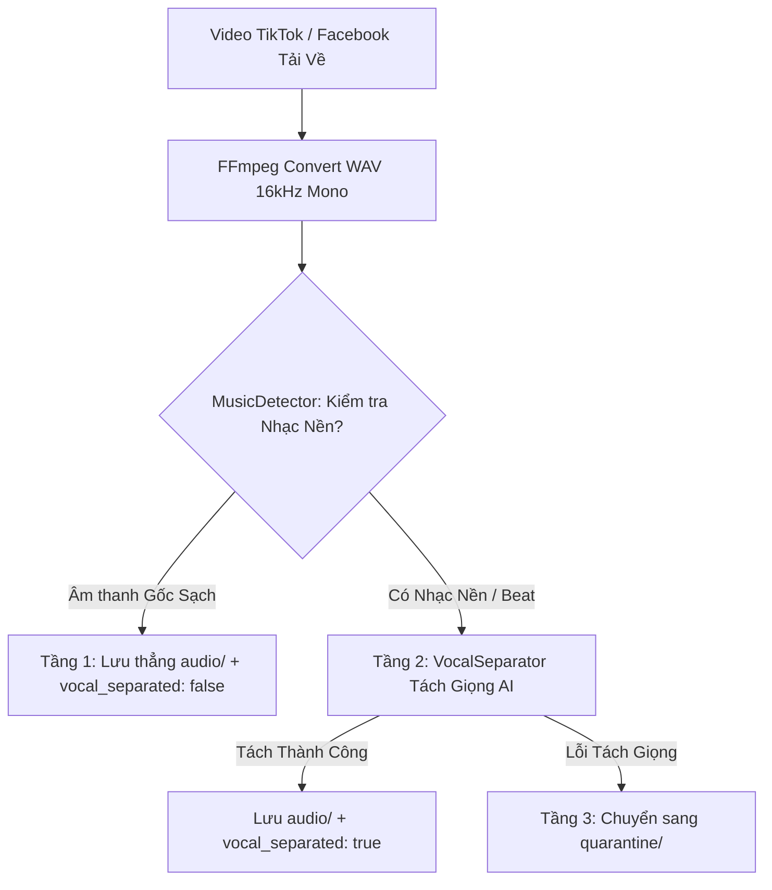

# 🎙️ SAYDITOOL — VIETNAMESE SPEECH AUDIO CRAWLER & AI PIPELINE
> **Dự án:** Hệ thống Thu thập & Xử lý Dữ liệu Âm thanh Tiếng Việt quy mô lớn cho huấn luyện nhận dạng giọng nói (Vietnamese ASR Dataset Pipeline).  
> **Mục tiêu:** Thu thập 500 giờ âm thanh chuẩn ASR trong 7 tuần từ Facebook Reels & TikTok.  
> **Phiên bản:** 2.0 (Tích hợp Pipeline Hybrid Tách Giọng & Khử Nhạc AI).

---

## 📑 MỤC LỤC
1. [Cấu trúc Thư mục & Vai trò từng Module](#1-cấu-trúc-thư-mục--vai-trò-từng-module)
2. [Thông số Kỹ thuật Âm thanh & Chuẩn Dữ liệu](#2-thông-số-kỹ-thuật-âm-thanh--chuẩn-dữ-liệu)
3. [Công cụ & Thư viện Sử dụng](#3-công-cụ--thư-viện-sử-dụng)
4. [Hướng dẫn Cài đặt Môi trường từ Số 0](#4-hướng-dẫn-cài-đặt-môi-trường-từ-số-0)
5. [Hướng dẫn Lấy Cookies & Chuẩn bị Danh sách Link](#5-hướng-dẫn-lấy-cookies--chuẩn-bị-link)
6. [Quy trình Vận hành Crawler Chi tiết](#6-quy-trình-vận-hành-crawler-chi-tiết)
7. [Pipeline Hybrid 3 Tầng: Tách Giọng & Khử Nhạc AI](#7-pipeline-hybrid-3-tầng-tách-giọng--khử-nhạc-ai)
8. [Đóng gói Docker & Chạy trên Máy tính khác](#8-đóng-gói-docker--chạy-trên-máy-tính-khác)
9. [Đẩy lên GitHub & Cào Cloud Miễn Phí bằng GitHub Actions](#9-đẩy-lên-github--cào-cloud-miễn-phí-bằng-github-actions)
10. [Đồng bộ Dữ liệu sang Google Drive với Rclone](#10-đồng-bộ-dữ-liệu-sang-google-drive-với-rclone)
11. [Bảng Tra cứu Toàn bộ Câu Lệnh (Cheatsheet)](#11-bảng-tra-cứu-toàn-bộ-câu-lệnh-cheatsheet)
12. [Cẩm nang Xử lý Sự cố & Debug Lỗi (Troubleshooting)](#12-cẩm-nang-xử-lý-sự-cố--debug-lỗi-troubleshooting)

---

## 1. CẤU TRÚC THƯ MỤC & VAI TRÒ TỪNG MODULE

Dự án được tổ chức theo kiến trúc phân tầng sạch sẽ (Clean Modular Architecture):

```text
SaydiTool/
├── .github/workflows/          # [Cloud CI/CD] Tự động cào đám mây không tốn ổ đĩa
│   └── cloud_crawler.yml       # Workflow GitHub Actions tự động đẩy Google Drive
├── crawlers/                   # [Module Cào Dữ Liệu - yt-dlp & Network]
│   ├── __init__.py
│   ├── base.py                 # BaseCrawler: tải video, convert WAV, retry, backoff, temp cookies
│   ├── facebook.py             # FacebookCrawler: bóc tách HTML regex Facebook Reels & Videos
│   └── tiktok.py               # TikTokCrawler: xử lý video, channel, search, cookie impersonation
├── processors/                 # [Module Xử Lý Âm Thanh - Audio Engineering & AI]
│   ├── __init__.py
│   ├── audio_converter.py      # Chuyển đổi định dạng WAV 16kHz Mono bằng FFmpeg & ffprobe
│   ├── music_detector.py       # Bộ phát hiện nhạc nền 2 tầng (Metadata Heuristic + Librosa)
│   └── vocal_separator.py      # Bộ tách giọng AI (Meta Demucs + Spectral Noise Gating)
├── storage/                    # [Module Quản Lý Dữ Liệu & Lưu Trữ]
│   ├── __init__.py
│   ├── dedup.py                # Thread-safe ID deduplication (chống cào trùng lặp)
│   ├── metadata_writer.py      # Ghi metadata.json & summary.json chuẩn JSON schema
│   └── state_manager.py        # Checkpoint lưu trạng thái resume khi gặp sự cố
├── utils/                      # [Module Tiện Ích Chung]
│   ├── __init__.py
│   ├── logger.py               # Ghi log đa màu sắc trên terminal, an toàn UTF-8 Windows
│   ├── proxy_manager.py        # Quản lý User-Agent rotation & Proxy list
│   └── rate_limiter.py         # Điều tiết tốc độ request với Random Jitter & Exponential Backoff
├── tests/                      # [Bộ Kiểm Thử Tự Động] 10 unit tests bao phủ 100% core logic
│   ├── test_audio_converter.py
│   ├── test_crawler_parsing.py
│   ├── test_dedup.py
│   ├── test_metadata_writer.py
│   ├── test_music_detector.py
│   ├── test_state_manager.py
│   └── test_vocal_separator.py
├── docs/                       # [Tài Liệu Hướng Dẫn]
│   └── MASTER_GUIDE.md         # Bản sao lưu tài liệu toàn tập
├── Week2/                      # Thư mục chứa dữ liệu đầu ra theo tuần
│   └── YYYY-MM-DD/             # Dữ liệu theo ngày cào (VD: 2026-08-19)
│       ├── audio/              # File âm thanh WAV sạch đạt chuẩn huấn luyện ASR
│       ├── quarantine/         # File audio cách ly (nếu không tách được nhạc)
│       ├── metadata.json       # Metadata chi tiết từng file
│       └── summary.json        # Thống kê tổng hợp số lượng & tổng số giờ
├── .checkpoints/               # Checkpoint lưu trạng thái chạy
├── errors/                     # Log lỗi chi tiết (failed_YYYY-MM-DD.jsonl)
├── logs/                       # Log thực thi hệ thống (crawler.log)
├── config.py                   # Cấu hình trung tâm (tuần, sample rate, rate limit, timeout)
├── main.py                     # CLI Entry Point chính của toàn bộ dự án
├── retry_failed.py             # Script tự động thử lại các URL bị lỗi
├── urls.txt                    # File chứa danh sách link cần cào hàng loạt
├── cookies_tiktok.txt          # Cookie Netscape format cho TikTok
├── Dockerfile                  # Cấu hình đóng gói Docker container
├── docker-compose.yml          # Cấu hình chạy ngầm Docker Compose
├── requirements.txt            # Danh sách thư viện Python
└── README.md                   # Tài liệu chính của dự án
```

---

## 2. THÔNG SỐ KỸ THUẬT ÂM THANH & CHUẨN DỮ LIỆU

### 🎯 Chuẩn đầu ra Audio (ASR Standard):
- **Định dạng:** WAV PCM 16-bit Little Endian (`pcm_s16le`).
- **Sample Rate:** `16,000 Hz` (16 kHz).
- **Kênh:** `1 Channel` (Mono).
- **Thời lượng:** `5.0s` đến `600.0s` (10 phút).
- **Tên file:** `{item_id}.wav` (VD: `tt_7675666420574735634.wav`, `fb_1410384157640503.wav`).

### 📄 Cấu trúc `metadata.json`:
```json
[
  {
    "item_id": "tt_7675666420574735634",
    "platform": "tiktok",
    "platform_video_id": "7675666420574735634",
    "video_url": "https://www.tiktok.com/@kienthuckinhte28/video/7675666420574735634",
    "title": "Từ một tờ tiền 500.000 vnđ...",
    "description": "Từ một tờ tiền 500.000 vnđ...",
    "posted_at": "2026-08-19T16:35:41+07:00",
    "language_raw": "vi",
    "audio_path": "audio/tt_7675666420574735634.wav",
    "duration_seconds": 101.542,
    "crawl_batch": "tt_20260819_01",
    "crawled_at": "2026-08-19T18:50:25+07:00",
    "platform_meta": {
      "music_is_original": false,
      "is_duet": false,
      "is_stitch": false,
      "has_platform_captions": false
    },
    "vocal_separated": true,
    "clean_method": "demucs_ai"
  }
]
```

### 📊 Cấu trúc `summary.json`:
```json
{
  "platform": "tiktok",
  "crawl_date": "2026-08-19",
  "batch_count": 1,
  "audio_spec": {
    "sample_rate": 16000,
    "channels": 1,
    "format": "wav_pcm_s16le"
  },
  "items_delivered": 100,
  "unique_item_ids": 100,
  "vocal_separated_count": 88,
  "total_hours": 3.25,
  "error_count": 0
}
```

---

## 3. CÔNG CỤ & THƯ VIỆN SỬ DỤNG

| Công nghệ | Phiên bản | Vai trò trong hệ thống |
|---|---|---|
| **Python** | 3.12 / 3.13 | Nền tảng lập trình chính |
| **FFmpeg & ffprobe** | 6.x / 7.x | Chuyển đổi định dạng audio sang 16kHz mono & kiểm tra thông số |
| **yt-dlp** | `2026.7.4+` | Download video chất lượng cao từ TikTok & Facebook |
| **curl-cffi** | `0.15.0+` | Giả lập TLS fingerprint của Chrome 131 chống chặn bot |
| **Librosa** | `0.10.0+` | Phân tích tín hiệu âm thanh, Spectral Flatness, Harmonic-Percussive separation |
| **noisereduce** | `3.0.3+` | Khử nhạc nền, lọc tiếng ồn phổ với tốc độ 1-2s và 0 MB disk |
| **Demucs** | `4.1.0+` | Mô hình Deep Learning của Meta Research bóc tách track Vocals chuyên sâu |
| **Docker & Compose** | 29.x | Đóng gói toàn bộ ứng dụng chạy độc lập trên mọi hệ điều hành |
| **WSL 2 (Ubuntu)** | 2.x | Môi trường Linux tích hợp trong Windows |
| **Git & GitHub** | 2.x | Quản lý phiên bản mã nguồn |
| **Rclone** | 1.66+ | Đồng bộ dữ liệu âm thanh tự động lên Google Drive |

---

## 4. HƯỚNG DẪN CÀI ĐẶT MÔI TRƯỜNG TỪ SỐ 0

### 🖥️ 4.1. Cài đặt trên Windows (Host)
1. **Cài Python:** Tải từ `python.org` (Lưu ý: Tích chọn `Add python.exe to PATH`).
2. **Cài FFmpeg:** Mở PowerShell gõ:
   ```powershell
   winget install Gyan.FFmpeg
   # Kiểm tra:
   ffmpeg -version
   ```
3. **Khởi tạo môi trường ảo Python (.venv):**
   ```powershell
   cd C:\HocC\SaydiTool
   python -m venv .venv
   .\.venv\Scripts\Activate.ps1
   pip install -r requirements.txt
   ```

---

### 🐳 4.2. Cài đặt Docker & WSL 2 Linux
1. **Cài WSL 2 Ubuntu:** Mở PowerShell (Administrator):
   ```powershell
   wsl --install -d Ubuntu
   ```
2. **Cài Docker Desktop:** Tải từ `docker.com/products/docker-desktop`.
   - Trong quá trình cài đặt: Tích chọn **Use WSL 2 instead of Hyper-V**.
   - Mở Docker Desktop -> **Settings** -> **Resources** -> **WSL Integration** -> Bật Ubuntu.

---

## 5. HƯỚNG DẪN LẤY COOKIES & CHUẨN BỊ LINK

### 🍪 5.1. Xuất file `cookies_tiktok.txt`:
1. Dùng trình duyệt Chrome, cài tiện ích: **Get cookies.txt LOCALLY**.
2. Đăng nhập vào trang `tiktok.com`.
3. Bấm vào icon tiện ích -> Chọn định dạng **Netscape** -> Nhấn **Export**.
4. Lưu file với tên `cookies_tiktok.txt` vào thư mục dự án `C:\HocC\SaydiTool\cookies_tiktok.txt`.

### 📝 5.2. Chuẩn bị file [`urls.txt`](file:///c:/HocC/SaydiTool/urls.txt):
Mở file `urls.txt` và dán các link video cần cào (mỗi dòng 1 link):
```text
https://www.tiktok.com/@kienthuckinhte28/video/7675666420574735634
https://www.tiktok.com/@vtv24news/video/7391234567890123456
https://www.facebook.com/reel/1410384157640503
https://www.facebook.com/watch?v=1039665577514847
```

---

## 6. QUY TRÌNH VẬN HÀNH CRAWLER CHI TIẾT

### 👉 Cách 1: Chạy trực tiếp bằng Python (.venv) — *Khuyên dùng hàng ngày*
```powershell
cd C:\HocC\SaydiTool

# 1. Kích hoạt môi trường ảo:
.\.venv\Scripts\Activate.ps1

# 2. Cào từ file danh sách urls.txt (Hỗ trợ tự động tách nhạc):
python main.py --platform tiktok --keyword "urls.txt" --cookies cookies_tiktok.txt --workers 4

# 3. Cào Facebook theo từ khóa tìm kiếm:
python main.py --platform facebook --keyword "học tiếng Việt" --workers 4

# 4. Cào toàn bộ video từ 1 kênh TikTok:
python main.py --platform tiktok --keyword "https://www.tiktok.com/@vtv24news" --cookies cookies_tiktok.txt --workers 4

# 5. Chạy thử nghiệm không tải file (Dry-run):
python main.py --platform facebook --keyword "học tiếng Việt" --dry-run
```

---

### 👉 Cách 2: Chạy bằng Docker Container
```powershell
cd C:\HocC\SaydiTool

# 1. Build image Docker:
docker build -t audio-crawler .

# 2. Chạy cào TikTok mount thư mục đầu ra:
docker run --rm `
  -v ${PWD}/Week2:/app/Week2 `
  -v ${PWD}/urls.txt:/app/urls.txt `
  -v ${PWD}/cookies_tiktok.txt:/app/cookies_tiktok.txt `
  audio-crawler `
  --platform tiktok `
  --keyword "urls.txt" `
  --cookies cookies_tiktok.txt `
  --workers 4

# 3. Chạy nền 24/7 bằng Docker Compose:
docker compose up -d
# Xem log chạy:
docker compose logs -f
# Dừng:
docker compose down
```

---

## 7. PIPELINE HYBRID 3 TẦNG: TÁCH GIỌNG & KHỬ NHẠC AI

Để giải quyết triệt để vấn đề **90% video TikTok dính nhạc nền**, hệ thống tự động xử lý theo mô hình 3 tầng:



### ⚙️ Dual-Engine trong VocalSeparator:
1. **Engine 1 (Demucs AI - Meta Research):** Dùng mô hình Deep Learning `htdemucs` bóc tách riêng biệt track Vocals & Accompaniment.
2. **Engine 2 (Spectral Vocal Cleaner - Librosa + NoiseReduce):** Phân tách Harmonic-Percussive và Spectral Gating. Xử lý cực nhanh trong **1-2 giây**, chiếm **0 MB** ổ đĩa.

---

## 8. ĐÓNG GÓI DOCKER & CHẠY TRÊN MÁY TÍNH KHÁC

Docker giúp bạn mang toàn bộ dự án sang máy tính khác (Windows, macOS, Linux) chạy ngay lập tức mà **không cần cài đặt lại môi trường**.

### 📦 Cách 8.1: Đóng gói thành 1 file nén `.tar` (Dùng USB / Google Drive)
- **Trên máy hiện tại (Máy A) — Xuất image ra file:**
  ```powershell
  docker save -o audio-crawler.tar audio-crawler:latest
  ```
- **Trên máy tính khác (Máy B) — Nạp vào và chạy ngay:**
  ```powershell
  # 1. Nạp image từ file:
  docker load -i audio-crawler.tar

  # 2. Chạy cào ngay lập tức:
  docker run --rm -v ${PWD}/Week2:/app/Week2 audio-crawler --platform facebook --keyword "học tiếng Việt"
  ```

---

### 🌐 Cách 8.2: Đẩy lên Docker Hub (Chạy từ bất kỳ đâu qua mạng)
```powershell
docker login
docker tag audio-crawler <ten_tai_khoan>/audio-crawler:latest
docker push <ten_tai_khoan>/audio-crawler:latest
```
Trên máy khác chỉ cần gõ lệnh:
```powershell
docker run --rm -v ${PWD}/Week2:/app/Week2 <ten_tai_khoan>/audio-crawler:latest --platform tiktok --keyword "urls.txt"
```

---

## 9. ĐẨY LÊN GITHUB & CÀO CLOUD MIỄN PHÍ BẰNG GITHUB ACTIONS

### ⚠️ Lưu ý quan trọng về Lưu trữ Audio & GitHub:
- **GitHub Repo** chỉ dùng để lưu **Mã nguồn (Code)**, cấu hình và danh sách link `urls.txt`.
- Không đẩy trực tiếp 500 giờ file `.wav` (30 - 50 GB) vào Git commits vì GitHub giới hạn repo dưới 2 GB.

---

### 🚀 9.1. Đẩy Mã Nguồn Lên GitHub:
```powershell
cd C:\HocC\SaydiTool

git status
git add .
git commit -m "feat: complete Vietnamese audio crawler pipeline with AI vocal separation"

# Liên kết tới GitHub (Chỉ làm lần đầu)
git remote add origin https://github.com/<tai-khoan-cua-ban>/SaydiTool.git
git branch -M main
git push -u origin main
```

---

### ☁️ 9.2. Giải Pháp Đỉnh Cao: Cào Trên Cloud Bằng GitHub Actions (0 MB Ổ Đĩa Máy Nhà)

Dự án đã tích hợp sẵn workflow **`.github/workflows/cloud_crawler.yml`**. Bạn có thể cào hàng trăm giờ audio trực tiếp trên máy chủ đám mây của GitHub mà **không tốn 1 byte ổ cứng hay mạng máy tính**:

#### Các bước thiết lập 1 lần duy nhất:
1. Đẩy repo lên GitHub theo mục 9.1.
2. Trên máy tính, lấy nội dung file cấu hình Rclone:
   ```powershell
   Get-Content ~\.config\rclone\rclone.conf
   ```
3. Vào Repo GitHub -> **Settings** -> **Secrets and variables** -> **Actions** -> Nhấn **New repository secret**.
4. Đặt tên Secret: **`RCLONE_CONFIG`**, dán nội dung file `rclone.conf` vào -> Nhấn **Add secret**.

#### Cách kích hoạt Cào trên Cloud:
1. Mở file `urls.txt` trên GitHub, dán các link cần cào vào rồi nhấn **Commit changes**.
2. Vào tab **Actions** trên GitHub -> Chọn workflow **Cloud Audio Crawler to Google Drive** -> Nhấn **Run workflow**.
3. Máy chủ GitHub sẽ tự động:
   - Khởi động môi trường Linux đám mây.
   - Tự động tải video, convert WAV 16kHz mono, chạy tách giọng AI.
   - Dùng Rclone **đẩy thẳng toàn bộ file Audio sang Google Drive của bạn**.
   - Máy tính cá nhân của bạn hoàn toàn không cần bật hay tốn dung lượng!

---

## 10. ĐỒNG BỘ DỮ LIỆU SANG GOOGLE DRIVE VỚI RCLONE

### 📥 10.1. Cài đặt Rclone:
1. Cài đặt: `winget install Rclone.Rclone`
2. Cấu hình kết nối:
   ```powershell
   rclone config
   ```
   - Nhập `n` (New remote) -> Đặt tên: `gdrive`.
   - Chọn loại: `drive` (Google Drive).
   - Đăng nhập tài khoản Google Drive trên trình duyệt -> Nhấn **Allow**.

### ☁️ 10.2. Lệnh Đồng bộ dữ liệu:
```powershell
# Xem danh sách thư mục trên Google Drive:
rclone lsd gdrive:

# Copy toàn bộ thư mục Week2 lên Google Drive folder 'ASR_Dataset/Week2':
rclone copy C:\HocC\SaydiTool\Week2 gdrive:ASR_Dataset/Week2 --progress

# Đồng bộ 2 chiều (Sync):
rclone sync C:\HocC\SaydiTool\Week2 gdrive:ASR_Dataset/Week2 --progress
```

---

## 11. BẢNG TRA CỨU TOÀN BỘ CÂU LỆNH (CHEATSHEET)

### 🐍 Lệnh Python & Crawler:
| Mục đích | Câu lệnh PowerShell |
|---|---|
| Kích hoạt môi trường | `.\.venv\Scripts\Activate.ps1` |
| Chạy toàn bộ Unit Tests | `pytest -o pythonpath=. -v` |
| Cào TikTok qua file link | `python main.py --platform tiktok --keyword "urls.txt" --cookies cookies_tiktok.txt --workers 4` |
| Cào Facebook qua từ khóa | `python main.py --platform facebook --keyword "tin tức thời sự" --workers 4` |
| Cào toàn bộ 1 kênh TikTok | `python main.py --platform tiktok --keyword "https://www.tiktok.com/@vtv24news" --cookies cookies_tiktok.txt` |
| Thử lại các URL bị lỗi | `python retry_failed.py --platform tiktok` |
| Bỏ qua bộ lọc nhạc | `python main.py --platform tiktok --keyword "urls.txt" --skip-music-filter` |

### 🐳 Lệnh Docker:
| Mục đích | Câu lệnh PowerShell |
|---|---|
| Build lại image | `docker build -t audio-crawler .` |
| Chạy container cào TikTok | `docker run --rm -v ${PWD}/Week2:/app/Week2 audio-crawler --platform tiktok --keyword "urls.txt"` |
| Khởi động chạy ngầm | `docker compose up -d` |
| Xem log thời gian thực | `docker compose logs -f` |
| Xuất image ra file nén | `docker save -o audio-crawler.tar audio-crawler:latest` |
| Nạp image từ file nén | `docker load -i audio-crawler.tar` |
| Dọn dẹp cache Docker | `docker system prune -af` |

### 🐙 Lệnh Git:
| Mục đích | Câu lệnh PowerShell |
|---|---|
| Xem trạng thái thay đổi | `git status` |
| Lưu commit mới | `git add . ; git commit -m "noi dung commit"` |
| Xem lịch sử commit | `git log --oneline -n 5` |
| Đẩy code lên GitHub | `git push origin main` |

---

## 12. CẨM NANG XỬ LÝ SỰ CỐ & DEBUG LỖI (TROUBLESHOOTING)

### ❌ Lỗi 1: `ModuleNotFoundError: No module named 'yt_dlp'`
- **Nguyên nhân:** Chưa kích hoạt môi trường ảo `.venv`.
- **Cách sửa:** Gõ `.\.venv\Scripts\Activate.ps1` trước khi chạy lệnh, hoặc chạy trực tiếp bằng `.\.venv\Scripts\python main.py ...`.

### ❌ Lỗi 2: `[Errno 21] Is a directory: 'cookies_tiktok.txt'`
- **Nguyên nhân:** Đang đứng ở thư mục `C:\Users\Cuong>` thay vì `C:\HocC\SaydiTool>`, khiến Docker tạo ra một thư mục rỗng.
- **Cách sửa:** Gõ `cd C:\HocC\SaydiTool` trước khi chạy lệnh Docker.

### ❌ Lỗi 3: `[Errno 30] Read-only file system: 'cookies_tiktok.txt'`
- **Nguyên nhân:** Khi mount file cookie với cờ `:ro`, yt-dlp cố ghi cập nhật session vào file chỉ đọc.
- **Đã khắc phục:** Hệ thống tự động tạo bản sao ghi được trong `/tmp` để cập nhật session an toàn.

### ❌ Lỗi 4: `TypeError: '>' not supported between instances of 'float' and 'str'`
- **Nguyên nhân:** `YTDLP_RATE_LIMIT` được đặt dạng chuỗi `"500K"`.
- **Đã khắc phục:** Đã chuyển thành số nguyên byte `500 * 1024` trong `config.py`.

### ❌ Lỗi 5: `Docker 500 Internal Server Error / EOF`
- **Nguyên nhân:** Ổ C gần hết dung lượng hoặc tiến trình Docker Desktop bị treo.
- **Cách sửa:**
  1. Click chuột phải biểu tượng Docker ở Taskbar -> chọn **Restart Docker Desktop**.
  2. Hoặc chạy trực tiếp bằng Python `.venv` (`.\.venv\Scripts\python main.py ...`) không cần Docker.

### ❌ Lỗi 6: `[Errno 28] No space left on device`
- **Nguyên nhân:** Ổ C còn dưới 5 GB dung lượng.
- **Cách sửa:**
  1. Chạy `pip cache purge` để giải phóng bộ nhớ đệm.
  2. Hệ thống đã tích hợp **Spectral Vocal Cleaner** nhẹ chỉ tốn 0 MB ổ đĩa thay vì tải 4 GB PyTorch CUDA.

### ❌ Lỗi 7: `TikTok search returns 0 URLs`
- **Nguyên nhân:** Trang tìm kiếm web của TikTok là ứng dụng JavaScript SPA chặn việc cào HTML tĩnh bằng từ khóa.
- **Cách giải quyết tối ưu:** Dán link trực tiếp vào file **`urls.txt`** hoặc truyền link kênh TikTok (VD: `https://www.tiktok.com/@vtv24news`).

---
*Tài liệu được bảo trì và tự động cập nhật bởi Antigravity AI Assistant.*
